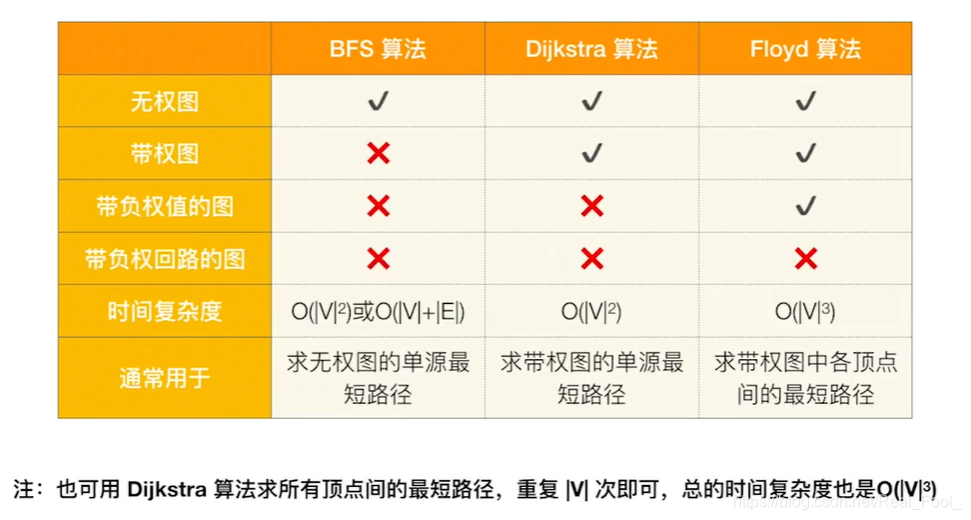
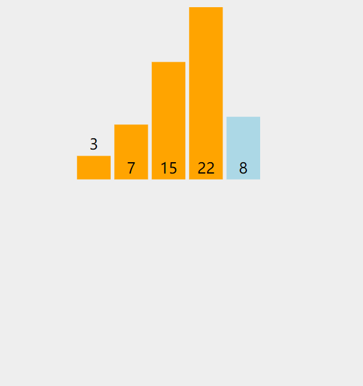

# CH7 Graph 第七章 图

* Definitions and Terminology 定义和术语

* Implementation of Graph 图的代码实现

* Graph Traversal 图的遍历

* Topological Sort 拓扑排序

* Shortest-Path Algorithms 最短路径算法

* Network Flow Problems 网络流量问题

* Minimum Spanning Tree 最小生成树

https://www.bilibili.com/video/BV19k4y1Q7Gj

## Definitions and Terminology 定义和术语

### Definition 定义

* G( V, E )where G ::= graph,V = V( G ) ::= finite nonempty set of vertices 有限非空顶点集E = E( G ) ::= finite set of edges. 有限的一组边缘

* General graphs differ from trees 一般图与树不同
  
  * need not have a root node 不需要有根节点
  
  * no implicit parent-child relationship 没有隐含的亲子关系
  
  * may be several (or no) paths from one vertex to another. 可能是从一个顶点到另一个顶点的多个(或没有)路径

### Terminologies

* Undirected graph 无向图: ( vi , vj ) = ( vj , vi )  the same edge   ( vi , vj ) 、( vj , vi ) 为同一个边 .

* Directed graph (digraph) 有向图: < vi , vj > $\ne$< vj , vi >

* Restrictions 限制 :
  
  * Self loop is illegal. 自循环是非法的。
  
  * Multigraph is not considered 不考虑乘法

* Complete graph 完全图: a graph that has the maximum number of edges 具有最大边数的图 （全连接）

* 
  $v_i$ and $v_j$ are adjacent 邻接 $( v_i , v_j )$ is incident on $v_i$ and $v_j$

* 
  $v_i$ is adjacent to $v_j$ ; $v_j$ is adjacent from $v_i$ ;$< v_i , v_j >$ is incident on $v_i$and $v_j$

* G’ is a subgraph 子图 of G ::= $\text{V(G')} \subseteq \text{V(G)} \; \&\& \; \text{E(G')} \subseteq \text{E(G)}$

* $\text{Path 路径 (}\subseteq \text{G) from } v_p \text{ to } v_q ::= \{ v_p, v_{i_1}, v_{i_2}, \dots, v_{i_n}, v_q \} \\ \text{such that } (v_p, v_{i_1}), (v_{i_1}, v_{i_2}), \dots, (v_{i_n}, v_q) \text{ or } \langle v_p, v_{i_1}, \dots, v_{i_n}, v_q \rangle \text{ belong to E(G)}$

* Length of a path 路径长度 ::= number of edges on the path

* Simple path 简单路径 ::= $v_{i_1}, v_{i_2}, \dots, v_{i_n}$ are distinct

* Cycle 环路/回路 ::= simple path with $v_p = v_q$

* $v_i \text{ and } v_j$ in an undirected G are connected if there is a path from $v_i$ to $v_j$ (and hence there is also a path from $v_i$ to $v_j$ )

* $\text{An undirected graph } G \text{ is \textbf{connected} if every pair of distinct } v_i \text{ and } v_j \text{ are connected}$

* (Connected) Component of an undirected G 连通分量 ::= the maximal connected subgraph

* A DAG 有向无环图 ::= a directed acyclic graph

* Strongly connected directed graph G 有向图强连通和弱连通 ::= for every pair of $v_i$ and $v_j$ in V( G ), there exist directed paths from $v_i$ to $v_j$ and from $v_j$ to $v_i$. If the graph is connected without direction to the edges, then it is said to be weakly connected

* Strongly connected component 有向图的强连通分量 ::= the maximal subgraph that is strongly connected

* Degree( v ) 度 ::= number of edges incident to v. For a directed G, we have in-degree and out-degree.
  入度in-degree 出度out-degree
  
  
* Given G with n vertices and e edges, then
  
  $$
  e = \left( \sum_{i=0}^{n-1} d_i \right) / 2 \quad \text{where} \quad d_i = \text{degree}(v_i) 
  $$

## Implementation of Graph  图的实现

### Adjacency Matrix 邻接矩阵

```c
#define maxvtxnum user_supply
typedef struct {
	Edgetype    
	arc[maxvtxnum][maxvtxnum];
	int vtxnum, arcnum;
} graph;                                     
```

$$
A_{ij} = \begin{cases} 0 & (v_i, v_j) \notin E \\ 1 & (v_i, v_j) \in E \end{cases}
$$

Note: For a weighted digraph, the weight of the edge from vertex i  to vertex j is used instead of 1 in the adjacency matrix.  
注意: 对于一个加权有向图，在邻接矩阵中使用从顶点 i 到顶点 j 的边的权重来代替1。


* Merits of Adjacency Matrix   
  邻接矩阵的优点
  * Fromthe adjacency matrix, to determine the connection of vertices is easy  
      从邻接矩阵来看，确定顶点之间的连接是很容易的
  
  * The degree of a vertex is $\sum_{j=1}^n A[i][j]$
  
  * For adirected digraph, the sum of 1 (or true) in row i of the adjacency matrix is the out-degree of the ith vertex.  
      对于有向有向图，邻接矩阵第i行的1(或 true)之和就是第i个顶点的出度。

  * The sum of the entries in the ith column is its in-degree.  
      第 i 列中的条目之和是它的度数。
  
* Disadvantage of adjacencymatrix:   
  邻接矩阵的缺点:
  * If a graph does not have many edges, theadjacency matrix will be sparse, and thus a waste of space如果一个图没有很多边，那么邻接矩阵将是稀疏的，从而浪费了空间

### Correlated  matrix 相关矩阵

```c
#define max vtxnum user_supply
#define maxedgenum user_supply

typedef struct {
	int arcs[maxvtxnum ][maxedgenum];
	int vtxnum,  arcnum;
}graph;
```


$$
B_{ij} = \begin{cases} 0 & v_i \text{ and } e_j \text{ not correlated  没有关联} \\ -1 & v_i \text{ is tail of } e_j \text{ 是尾 }\\ 1 & v_i \text{ is head of } e_j \text{ 是头 } \end{cases}
$$

### Adjacency  list 邻接表 （重点）

```c
#define maxvtxnum user_supply
typedef struct arcnode{
	int adjvex;
	edgetype info;
	struct arcnode * nextarc;
} arcnode;

typedef struct  {
	vextype   vexdata;
	struct  arcnode   * firstarc;
}vexnode;

vexnode adjlist[maxvtxnum]; 
```


**记录每个顶点连接到的别的顶点序号/指针**

Note:  The order of nodes in each list does not matter.  
注意: 每个列表中节点的顺序并不重要。

#### Inverse adjacency list 反相邻列表

**记录该节点的前向节点**

If G is directed, we need to find $i_n$-degree(v) as well.Addinverse adjacency lists.  Based on $i_n$-degree  
如果 G 是定向的，我们也需要找到 $i_n$ 度(v)。逆邻接列表。基于$i_n$度


### Orthogonal list 十字链表

```c
#define maxvtxnum user_supply
typedef struct anode  {
	int tailvex, headvex;
	struct anode * hlink , * tlink;
} anode;

typedef struct {
	vextype data;
	struct anode* firstin,* firstout;
} vnode;
vnode  ortlist[maxvtxnum];                                     
```


对于有向图来说，邻接表是有缺陷的。关心了出度问题，想了解入度就必须要遍历整个图才能知道，反之，逆邻接表解决了入度却不了解出度的情况。

分为弧（arc node）和节点（head node）分别储存

**其中**
**firstin表示入边表头指针，指向该顶点的入边表中第一个结点，**
**firstout 表示出边表头指针，指向该顶点的出边表中的第一个结点。**
**tailvex 是指弧起点在顶点表的下标，**
**headvex 是指弧终点在顶点表中的下标，**
**headlink是指入边表指针域，指向终点相同的下一条边，**  （入度）
**taillink是指边表指针域，指向起点相同的下一条边。**  （出度）
**如果是网，还可以再增加一个weight域来存储权值。**

### Adjacency multilist 邻接多重表

Only for undirected G 只对无向 G 有效
**邻接多重表是无向图的另一种链式存储结构。**

在邻接表中，容易求得顶点和边的各种信息，但在邻接表中求两个顶点之间是否存在边而对边执行删除等操作时，需要分别在两个顶点的边表中遍历，效率较低。


```c
#define maxvtxnum user_supply

typedef struct enode  {
	int mark, ivex, jvex;
    struct enode  * ilink, * jlink;
}  enode;

typedef struct   {
    vextype data;
    struct enode * firstedge;
}  vnode;

vnode admlist[maxvtxnum];
```


#### 邻接多重表的结构

在无向图中，每条边都会连接两个顶点。因此，邻接多重表通过双向链表来存储图的边信息，使得可以从任一顶点快速找到相连的另一顶点。邻接多重表通常由两部分组成：**顶点表**和**边表**。

1. **顶点表**：顶点表存储每个顶点的信息，每个顶点包含一个指向该顶点边表的链表头指针。顶点表的节点结构一般包括：
   * `vertex`：顶点的值或标识。
   * `first_edge`：指向该顶点相关边的链表的头指针。
   
2. **边表**：边表用于存储无向图中的边，每条边连接两个顶点。边表的节点结构一般包括：
   
   * `ivex`：边的一个顶点。
   * `jvex`：边的另一个顶点。
   * `ilink`：指向与`ivex`相连的下一条边的指针。
   * `jlink`：指向与`jvex`相连的下一条边的指针。
   * `info`（可选）：存储边的权重或其他信息。

## Graph Traversal 图的遍历

* Some applications requirevisiting every vertex in the graph exactly once.  
    有些应用程序要求只访问图中的每个顶点一次。

* The application may require thatvertices be visited in some special order based on graph topology  
  应用程序可能要求基于图拓扑结构以某种特殊顺序访问顶点
  * depth-first search  
      深度优先搜索
  
  * breadth-first search  
      广度优先搜索

### Depth-First Search 深度优先搜索

* Basic Idea
  
  * Start from a given vertex v and visit it.   
      从给定的顶点 v 开始，访问它。
  
  * Visit the first neighbor, w, of v. Then visit the first neighbor of w that has notalready been visited, etc.拜访第一个邻居，w，of v。  
      然后去拜访 W 的第一个邻居，这个邻居还没有被拜访过，等等。
  
  * If a node with no unexamined neighbors, then backup to the last visited node andexamine its remaining neighbors.  
      如果一个节点没有未检查的邻居，则回溯到到最后访问的节点，并检查其余的邻居。
  
  * The search continues until all nodes of the graph have been examined.  
      继续搜索，直到检查完图的所有节点。
  
  DFS 的核心思想是尽可能深入地探索图的分支。从起始节点开始，沿着一条路径一直向前，直到无法继续为止，然后回溯到上一个节点，探索其他未访问的路径。这种方法类似于迷宫中一直走到底，如果遇到死路就回头寻找其他路径。
  
* algorithm 算法
  
  * 非递归：
  
      * 用栈
  
      
  
  * 递归
  
    * Visit the start vertex v.访问起始顶点 v 。
        * Using an array visited[n]. When i-th vertex has been visited, visited[i]=1.使用访问过的数组[ n ]。  
            当访问过第 i 个顶点时，访问过的[ i ] = 1。
  
    * For each vertex w adjacent to v do:对于与 v 相邻的每个顶点 w:
  
      * If w has not been visited,apply the depth-first search algorithm with w as the start vertex.如果 w 没有被访问过，应用以 w 作为开始顶点的深度优先搜索算法。（recursion 递归）
  
    
  
    
  
    ```mermaid
    flowchart TB
    A["Begin"] --> B["Visited array initial."]
    B --> C["Vi = 1"]
    C --> D{"Vi visited?"}
    D -- "Yes" --> E["DFS(Vi)"]
    D -- "No" --> F{"Vi == Vexnums"}
    E --> F
    F -- "Yes" --> G["End"]
    F -- "No" --> H["Vi = Vi + 1"]
    H --> D
    
    %% Right Side Subflow
    I["Begin"] --> J["Visit Vi, set flag"]
    J --> K["Find Vi's neighbor"]
    K --> L{"Neighbor W exists?"}
    L -- "No" --> M["End"]
    L -- "Yes" --> N{"W visited?"}
    N -- "Yes" --> O["Find next neighbor"]
    N -- "No" --> P["DFS(W)"]
    P --> O
    O --> K
    ```
  
* Algorithm Analysis Let G=(V,E) be a graph with n vertices and e edges.  
  算法分析设 G = (V，E)是一个有 n 个顶点和 e 条边的图。

  * Adjacency list: $O(n+e)$。go through vertices and existing edges 通过顶点和已有的边

  * Adjacency matrix:$O(n^2)$。traverse the nxn matrix (including non-existent edges) 遍历 nxn 矩阵(包括不存在的边)

### Breadth-First Search 广度优先搜索

* Basic Idea：
  
  * Start from a given vertex v and visit it. 从给定的顶点 v 开始，访问它。
  
  * Visit all neighbors of v.拜访所有的邻居。
  
  * Then visit all neighbors of first neighbor w of v.拜访所有第一邻居的邻居。
  
  * Then visit all neighbors of second neighbor x of v, etc.然后访问 v 的第二个邻居 x 的所有邻居，等等。
  
  BFS 的核心思想是层层推进地遍历节点。从起始节点开始，首先访问其所有直接邻接节点，然后依次访问这些邻接节点的邻接节点，逐层向外扩展。这种方法类似于波纹从中心向外扩散。

* Algorithm
  
  * For the start vertex v, after we visit it, we find all neighbors of v, which are not visited before. We visited them and store them in a queue. Then the vertices in the nextlevel are ready in the queue.   
      对于起始点 v，在我们访问它之后，我们会找到 v 的所有邻居，这些邻居以前从未访问过。我们访问了它们，并将它们存放在一个队列中。然后，下一级中的顶点就在队列中准备好了。
  
  * Then we pick a vertex at the head of the queue and do the same thing above, and soon…  
      然后我们在队列的最前面选一个顶点然后做上面的事情，很快 。。。
  
  * BFS
    
    * Visit the start vertex v.  
        访问起始顶点 v。
    * Initialize a queue to contain only the start vertex.  
        将队列初始化为只包含开始顶点。
    * While the queue is not empty do:  
      当队列不是空的时候，请:
      * Remove a vertex v from the queue.  
          从队列中删除顶点 v。
      * For all vertices w adjacent to v do:  
        对于与 v 相邻的所有顶点 w:
        * If w has not been visited then  
          如果w没有被拜访过
          * Visit w.  
              访问 w
          * Add w to the queue  
              将w添加到队列中
    
    
    
    
    
    ```mermaid
    
    flowchart TB
    %% 左侧流程图部分
    A["Begin"] --> B["Visited array initial."]
    B --> C["Vi = 1"]
    C --> D{"Vi visited?"}
    D -- "Yes" --> E{"Vi == Vexnums"}
    D -- "No" --> F["BFS"]
    E -- "Yes" --> G["End"]
    E -- "No" --> H["Vi = Vi + 1"]
    H --> D
    
    %% 右侧 BFS 子流程图
    I["Visit Vi, set flag"] --> J["Queue initial."]
    J --> K["Vi enqueue"]
    K --> L{"Queue empty?"}
    L -- "Yes" --> M["End"]
    L -- "No" --> N["Head V dequeue"]
    N --> O["Find V's neighbor W"]
    O --> P{"W exists?"}
    P -- "No" --> L
    P -- "Yes" --> Q{"W visited?"}
    Q -- "Yes" --> R["Find next neighbor"]
    Q -- "No" --> S["Visit W, set flag"]
    S --> T["W enqueue"]
    T --> R
    R --> O
    ```
  
* Complexity: The same as DFS!复杂性: 与 DFS 相同！

* * *

**深度优先搜索（DFS）：**

1. **初始化：** 从起始节点开始，将其标记为已访问。

2. **递归访问：** 对于当前节点的每个未被访问的邻接节点：
   
   * 标记该邻接节点为已访问。
   
   * 递归地对该邻接节点进行深度优先搜索。

3. **回溯：** 当当前节点的所有邻接节点都被访问后，回溯到上一个节点，继续访问其他未被访问的邻接节点。

4. **结束条件：** 当所有节点都被访问后，算法结束。

**广度优先搜索（BFS）：**

1. **初始化：** 从起始节点开始，将其标记为已访问，并将其加入队列。

2. **迭代访问：** 当队列不为空时，重复以下步骤：
   
   * 从队列中取出一个节点作为当前节点。
   
   * 对于当前节点的每个未被访问的邻接节点：
     
     * 标记该邻接节点为已访问。
     
     * 将该邻接节点加入队列。

3. **结束条件：** 当队列为空时，算法结束。

* * *

## Topological Sort 拓扑排序

【Definition】A topological order is a linear ordering of the vertices of a graph such that, for any two vertices, i, j,if i is a predecessor of j in the network then i precedes j in the linear ordering.  
[定义]拓扑有序是图的顶点的线性排序，对于任意两个顶点，i，j，如果 i 是网络中 j 的前辈，那么 i 在线性排序中位于 j 之前

**在一个表示工程的有向图中，用顶点表示活动，用弧表示活动之间的优先关系，这样的有向图为顶点表示活动的网，我们称为AOV网( Activity On VertexNetwork)。**

所谓**拓扑排序，其实就是对一个有向图构造拓扑序列的过程**。每个AOV网都有一个或多个拓扑排序序列

* AOV(Activity on Vertex) Network 顶点活动网络
  
  * digraph G in which V( G ) represents activities and E( G ) represents precedence relations AOV网络：指的是一个有向图 $G$ ，其中 $V(G)$ 表示活动（例如课程），而 $E(G)$ 表示优先关系（例如，C1 → C3 意味着C1是C3的前置课程）。
  * i  is a predecessor of j ::= there is a path from i  to ji  is an immediate predecessor of  j ::= < i,  j > Î E( G ) Then j is called a successor ( immediate successor ) of i如果在图中从顶点 $i$ 到顶点 $j $ 存在路径，那么 $i$ 是 $j$ 的前驱节点。特别地，如果 $i$ 是 $j$ 的直接前驱节点，则有 $i < j, j \in E(G)$。顶点 $j$ 也被称为 $i$ 的后继节点（或者直接后继）。
  * **Feasible AOV network must be a dag (directed acyclic graph).** 可行的AOV网络必须是**有向无环图**（DAG）。

* Note:  The topological orders may not be unique for a  network.注意: 网络的拓扑顺序可能不是唯一的。

#### Test an AOV for feasibility, and generate a topological order if possible. 测试AOV网络的可行性并生成一个拓扑排序（如果可行）

```c
void Topsort( Graph G ) {
    int Counter;
    Vertex V, W;
    for ( Counter = 0; Counter < NumVertex; Counter++ ) {
        V = FindNewVertexOfDegreeZero();  // 复杂度为 O(|V|)
        if ( V == NotAVertex ) {
            Error("Graph has a cycle");
            break;
        }
        TopNum[V] = Counter;  // 输出顶点 V 的顺序
        for ( each W adjacent to V ) {
            Indegree[W]--;
        }
    }
}
```

$T = O( |V|^2 )$

* Improvement: Keep all the unassigned vertices of degree 0 in a special box (queue or stack).  
  改进: 将0度的所有未分配顶点保存在一个特殊的盒子(队列或堆栈)中。
  
  ```c
  void Topsort( Graph G ) {
      Queue Q;
      int Counter = 0;
      Vertex V, W;
      Q = CreateQueue( NumVertex ); MakeEmpty( Q );
      for ( each vertex V ) {
          if ( Indegree[V] == 0 ) Enqueue( V, Q );  // 将入度为0的顶点加入队列
      }
      while ( !IsEmpty( Q ) ) {
          V = Dequeue( Q );  // 从队列中取出顶点
          TopNum[V] = ++Counter;  // 分配下一个拓扑排序的值
          for ( each W adjacent to V ) {
              if ( --Indegree[W] == 0 ) Enqueue( W, Q );  // 如果入度变为0，将W加入队列
          }
      }
      if ( Counter != NumVertex ) {
          Error("Graph has a cycle");  // 如果不能遍历所有顶点，说明图中有环
      }
      DisposeQueue( Q );  // 释放内存
  }
  ```
  
  $T = O( |V| + |E| )$最后一个程序的逻辑是一个改进版的拓扑排序算法，旨在高效地对一个有向无环图（DAG）进行排序。具体逻辑如下：
1. **初始化**：
   
   * 创建一个队列 `Q` 用于存储入度为 0 的顶点。
   * 初始化一个计数器 `Counter` 为 0，表示已经被处理的顶点数量。

2. **将所有入度为 0 的顶点加入队列**：
   
   * 遍历图中的所有顶点，如果顶点的入度为 0，就将其放入队列 `Q` 中。入度为 0 的顶点表示它没有依赖于其他顶点，可以直接处理。

3. **拓扑排序过程**：
   
   * 使用一个 `while` 循环，当队列 `Q` 非空时重复以下步骤：
     * 从队列中取出一个顶点 `V`。
     * 将 `V` 在拓扑排序中的位置通过 `TopNum[V] = ++Counter` 记录下来。
     * 遍历所有与 `V` 相邻的顶点 `W`（即 `V` 指向的顶点），将 `W` 的入度减 1，因为 `V` 已经被处理。
     * 如果 `W` 的入度变为 0，则将 `W` 加入队列 `Q`，表示它可以被处理。

4. **检测图中是否有环**：
   
   * 在处理所有顶点后，如果 `Counter` 小于顶点总数 `NumVertex`，则说明图中存在环，无法进行拓扑排序。

5. **释放内存**：
   
   * 释放用于存储的队列 `Q`。
   
   逻辑总结该程序通过维护一个队列，逐步处理入度为 0 的顶点并降低相邻顶点的入度。这样可以确保每个顶点只在满足其所有前驱节点都被处理后，才会被加入拓扑排序。因此，这种方法适用于有向无环图（DAG）的拓扑排序，如果图中存在环，则会检测并报错。

#### AOE网络实现项目调度

这是关于AOE（Activity On Edge）网络的简要说明，特别是与项目调度相关的概念。

* 在AOE网络中，边表示活动，节点表示事件。例如，活动 $a_i$ 是一条边，节点 $v_j$ 表示该活动的结束。
* 每个节点$v_j$的完成时间可以用以下两个值表示：
  * **EC[j]**（Earliest Completion Time）：节点$v_j$的最早完成时间。
  * **LC[j]**（Latest Completion Time）：节点$v_j$的最晚完成时间。

##### 关键路径法（CPM, Critical Path Method）

* **CPM** 是一种用来分析和优化项目调度的技术。它涉及计算项目中所有活动的最早和最晚完成时间，从而确定项目的关键路径。关键路径是项目中耗时最长的路径，决定了项目的最短完成时间。

* 相关时间指标：
  
  * **持续时间（Lasting Time）**：任务的持续时间。
  * **松弛时间（Slack Time）**：允许活动延迟的时间，而不会影响项目的整体完成时间。

* 

* 简而言之，AOE网络用于表示活动和事件之间的关系，以便对项目进行有效的调度和管理。

* 计算
  
  * Calculation of EC:
    
    $$
    EC[w] = \max_{(v,w) \in E} \left\{ EC[v] + C_{v,w} \right\}
    $$
  
  * Calculation of LC:
    
    $$
    LC[v] = \min_{(v,w) \in E} \left\{ LC[w] - C_{v,w} \right\}
    $$
  
  * Slack Time:
    
    $$
    \langle v, w \rangle = LC[w] - EC[v] - C_{v,w}
    $$
  
  * CriticalPath : path consisting entirely of zero-slack edges.
1. 计算最早完成时间（EC）
   
   * 从起点节点 $v_0$ 开始，对于任意活动 $a_i = \langle v, w \rangle$，其计算公式为：
     
     $$
     EC[w] = \max \{ EC[v] + C_{v,w} \}
     $$
     
     其中 $C_{v,w}$ 是从节点 $v$ 到节点 $w$ 的活动持续时间。即，节点 $w$ 的最早完成时间等于所有入射路径中最大的到达时间。

2. 计算最晚完成时间（LC）
   
   * 从终点节点开始（图中的节点 $v_8$），对于任意活动 $a_i = \langle v, w \rangle$，其计算公式为：
     
     $$
     LC[v] = \min \{ LC[w] - C_{v,w} \}
     $$
     
     这里，节点 $v$ 的最晚完成时间等于所有出射路径中最小的离开时间减去活动的持续时间。

3. 松弛时间计算
   
   * 活动 $\langle v, w \rangle$ 的松弛时间计算公式为：
     
     $$
     Slack\ Time\ = LC[w] - EC[v] - C_{v,w}
     $$
     
     松弛时间表示活动可以延迟的时间而不影响项目的整体进度。如果松弛时间为零，则活动位于关键路径上。

4. 关键路径
   
   * 关键路径是由所有松弛时间为零的活动组成的路径。它代表项目的最长路径，决定了项目的最短完成时间。

## Shortest-Path Algorithms 最短路径算法

Given a digraph $G = ( V, E )$, and a cost function $c( e)$ for $e \in E( G )$ . The length of a path *P* from source to destination is (also called weighted path length).在 E (G)中给定一个有向图 $G = (V，E) $和一个成本函数 $c (e) $ for $e \in E( G )$ 。路径 P 从源到目的地的长度是(也称为加权路径长度)。

$$
\sum_{e_i \subseteq P}c(e_i)
$$

### Single-Source Shortest-Path Problem 单源最短路问题

Given as input a weighted graph, G = ( V, E ), and a distinguished vertex, *s*, find the shortest weighted path from *s* to every other vertex in G.给定一个加权图 G = (V，E)和一个可区分的顶点 s 作为输入，求出从 s 到 G 中每个顶点的最短加权路径。


**Note:** **If there is no negative-cost cycle, the shortest path** **from** **s** **to** **s** **is defined to be** **zero**  
注意: 如果有负代价环路，那么从s 到s 的最短路径定义为0

### Unweighted Shortest Paths 未加权最短路径

Calculatethe shortest paths from short to long  
计算从短到长的最短路径


使用广度优先搜索（BFS）计算从源点到各个节点的最短路径，按照路径长度从短到长依次处理节点。

* **基本思路**：
  
  * 使用广度优先搜索（BFS）计算从源点到各个节点的最短路径，按照路径长度从短到长依次处理节点。

* **图示说明**：
  
  * 红色标注的节点 v3​ 是起始点，其路径长度为0。
  * 距离为1的节点是 v1​ 和 v6​，距离为2的是 v2​ 和 v4​，距离为3的是 v5​ 和 v7​。

* **实现细节**：
  
  * `Table[i].Dist` distance from s to $v_i$  /*initialized to be $\infin$ except for s */
    `Table[i].Dist` 表示从源点 s 到节点 vi​ 的距离，初始值设为无穷大，除了源点本身。
  
  * `Table[i].Known`  1 if $v_i$ is checked; or 0 if not
      `Table[i].Known` 表示节点 vi​ 是否已经被检查过，已检查的值为1，未检查的值为0。
  
  * `Table[i].Path`   for tracking the path  /* initialized to be 0 */
      `Table[i].Path` 用于记录路径，初始值为0。

```c
void Unweighted( Table T ) {
    int CurrDist;
    Vertex V, W;
    for ( CurrDist = 0; CurrDist < NumVertex; CurrDist++ ) {
        for ( each vertex V ) {
            if ( !T[ V ].Known && T[ V ].Dist == CurrDist ) {/*这里满足条件的 V 实际上是上次迭代的结果*/
                T[ V ].Known = true;
                for ( each W adjacent to V ) {
                    if ( T[ W ].Dist == Infinity ) {
                        T[ W ].Dist = CurrDist + 1;
                        T[ W ].Path = V;
                    } /* end-if Dist == Infinity */
                } /* end-for each W */
            } /* end-if !Known && Dist == CurrDist */
        } /* end-for each vertex V */
    } /* end-for CurrDist */
}
```

$$
T = O( |V|^2 )
$$

---


---

- Improvement

```c
void Unweighted( Table T )
{   /* T is initialized with the source vertex S given */
    Queue  Q;
    Vertex  V, W;
    Q = CreateQueue (NumVertex );  MakeEmpty( Q );
    Enqueue( S, Q ); /* Enqueue the source vertex */
    while ( !IsEmpty( Q ) ) {
        V = Dequeue( Q );
        T[ V ].Known = true; /* not really necessary */
        for ( each W adjacent to V )
            if ( T[ W ].Dist == Infinity ) {
                T[ W ].Dist = T[ V ].Dist + 1;
                T[ W ].Path = V;
                Enqueue( W, Q );
            } /* end-if Dist == Infinity */
    } /* end-while */
    DisposeQueue( Q ); /* free memory */
}

```

---


---

这段代码对无权图中最短路径的计算进行了改进，主要通过以下几个方面：

1. **使用队列的改进**：
   
   - 改进版的代码使用了一个队列来管理节点的访问顺序，从而避免了简单的逐层遍历。**利用队列实现的广度优先搜索（BFS）能够更有效地逐层扩展节点。（可以用类似于对拓扑排序所做的那样来排除这种低效性。）**
   - 初始时将源节点 $ S $ 入队，每次从队列中取出一个节点 $ V $，然后将所有与 $ V $ 相邻且未被访问过的节点 $ W $ 入队。

2. **减少不必要的检查**：
   
   - `T[V].Known = true` 表示当前节点 $ V $ 已被访问。虽然这个操作“不是很必要”，但有助于避免重复访问同一节点，从而提高算法的效率。

3. **时间复杂度的改进**：
   
   - 原始算法的时间复杂度是 $ O(|V|^2) $，其中 $ |V| $ 是节点数。而改进后的算法采用了队列，使得时间复杂度降为 $ O(|V| + |E|) $，其中 $ |E| $ 是边的数量。这是广度优先搜索的典型时间复杂度，对于稀疏图来说效率更高。

### *Dijkstra*’s Algorithm (for weighted shortest paths)  Dijkstra 算法(加权最短路径)

Let S = {vertices whose shortest paths have been found }  
设 S = {已找到最短路径的顶点}

For any $u \notin S$, define distance [ u ] = minimal length of path { $s \rightarrow (v_i \in S) \rightarrow u$ }. If the paths are generated in non-decreasing order (path length from 0, 1, 2, …), then   
对于任何 $u \notin S$，定义距离[ u ] = 路径{ $s \rightarrow (v _ i \in S) \rightarrow u $}的最小长度。如果路径是按非递减顺序生成的(路径长度从0,1,2，...) ，则

- the shortest path must go through ONLY a $v_i \in S$ ;  
  最短路径必须在 S 中只通过一个 $v _ i$;
  
  - If it is not true, then there must be a vertex w on this path that is not in S.   
     如果它不是真的，那么这条路径上一定有一个不在 S 中的顶点 w。  
  - Distance[w] must be shorter than current distance.    
     距离[ w ]必须短于当前距离。  
  - Since all vertices with length less than current distance  must be in S, which is opposite to the hypothesis.    
     因为所有长度小于当前距离的顶点都必须在 S 中，这与假设相反。   

- *u* is chosen so that distance[ u ] = min{ $w \notin S$ | distance[ w ] } (If *u* is not unique, then we may select any of them) ; *u* *is* *then* *put* *into* *S* /* Greedy Method */   
  选择u使得 `distance[u]` 最小，即：  
  $$
  distance[u]=min\{distance[w]∣w \notin S\}
  $$
  
  如果 u 不是唯一的，那么可以任意选择一个 u；随后将 u 加入集合 S 中。/* 贪心方法 */  
  
- *u* is in S now, then u’s neighbors’ shortest distance may be changed. Assume one neighbor w, then compare path { $s \rightarrow u \rightarrow w$ } with distance [ w ] *.* If “<“, distance’ [ *w* ] = distance [ *u* ] + length(< *u*, *w*>).   
  现在 $ u $ 在集合 $ S $ 中，接着 $ u $ 的邻接节点的最短距离可能会被更新。假设某个邻接节点为 $ w $，比较通过路径 $\{ s \rightarrow u \rightarrow w \}$ 到达 $ w $ 的距离和当前 `distance[w]`。如果前者更短，则更新 `distance[w]` 为：  
  $$
  distance'[w] = distance[u] + \text{length}(\langle u, w \rangle)
  $$

**通俗点说，这个迪杰斯特拉(Dijkstra) 算法，它并不是一下子求出最短路径，而是一步步求出它们之间顶点的最短路径，过程中都是基于已经求出的最短路径的基础上，求得更远顶点的最短路径，最终得到你要的结果。**

如果图有负的边值，那么 Dijkstra 算法是行不通的。

---


---

```c
Struct TableEntry
{
   List Header; // Adjacency list
   int known;
   DistType Dist;
   Vertex Path;
}
# define NotAVertex (-1)
Typedef struct TableEntry Table[ NumVertex];

Void InitTable ( Vertex Start, Graph G, Table T )
{
    int i;
     ReadGraph (G, T);
    for ( i=0; i< NumVertex; i++)
    {
     T[i].known = False;
     T[i].Dist = Infinity;
     T[i].Path = NotAVertex;
   }
     T[ Start ].dist = 0;
}

void Dijkstra( Table T )
{   /* T is initialized in next slide*/
    Vertex  V, W;
    for ( ; ; ) {
        V = unknown vertex with the smallest distance;
        if ( V == NotAVertex )
	break; 
        T[ V ].Known = true;
        for ( each W adjacent to V )
	if ( !T[ W ].Known ) 
	    if ( T[ V ].Dist + Cvw < T[ W ].Dist ) {
	    	Decrease( T[ W ].Dist  to
			 T[ V ].Dist + Cvw );
		T[ W ].Path = V;
	    } /* end-if update W */
    } /* end-for( ; ; ) */
}/* not work for edge with negative cost */

```

-   algoritm analysis 算法分析

    -   V = smallest unknown distance vertex;  
        最小未知距离顶点

        /* simply scan the table – O( |V| ) */

    -   *T* = O( $|V|^2$ + |E| )*=* O($ |V|^2 $)

        -   O(|V|2 ): Each time to find smallest vertex takes $O(|V|)$, and thus the whole algorithm takes O$(|V|^2) $  

            每次求最小顶点取 $O (| V |)$ ，因此整个算法取 O $(| V | ^ 2 )$

        -   $O(|E|)$: Update w (adjacent to V) takes $O(|E|)$  
            $O (| E |) $: 更新 w (与 V 相邻)需要 $O (| E |) $


#### Graphs with Negative Edge Costs  (forget the known vertices)  具有负边代价的图(忘记已知的顶点)

```c
void  WeightedNegative( Table T )
{   /* T is initialized by Figure 9.30 */
	Queue  Q;
    Vertex  V, W;
    Q = CreateQueue (NumVertex );  MakeEmpty( Q );
    Enqueue( S, Q ); /* Enqueue the source vertex  对源顶点进行排队 */
    while ( !IsEmpty( Q ) ) { /* each vertex can dequeue at most |V| times  每个顶点最多可以出队|V|次 */
        V = Dequeue( Q );
        for ( each W adjacent to V ){
            if ( T[ V ].Dist + Cvw < T[ W ].Dist ) { /* no longer once per edge  不再是每边一次*/
                T[ W ].Dist = T[ V ].Dist + Cvw;
                T[ W ].Path = V;
                if ( W is not already in Q )
                    Enqueue( W, Q );
            } /* end-if update*/
        }/* end-for update*/
    } /* end-while */
    DisposeQueue( Q ); /* free memory */
}/* negative-cost cycle will cause indefinite loop  负成本循环会导致不确定的循环 */

```

### All-Pairs Shortest Path Problem  全源最短路径问题

-   For all pairs of $v_i $and $v_j$ ($i \ne j$), find the shortest path between.  
    对于 $v _ i $和 $v _ j $ ($i \ne j $)之间的所有对，找到两者之间的最短路径。

#### Method 1 Use single-source algorithm 

-   Use single-source algorithm for |V| times. 
    对 | V | 次使用单源算法。

-   *T* = O($ |V|^3 $) – works fast on sparse graph.

-   时间复杂度：*T* = O($ |V|^3 $) ，这是在每个节点执行单源最短路径（例如 Dijkstra 或 Bellman-Ford 算法）后累积的总复杂度。

    优势：这种方法在**稀疏图**（边数远小于$|V|^2$）中运行较快。

#### Method 2 O( $|V|^3$ ) algorithm

-   $ O( |V|^3 )$ algorithm, works faster on dense graphs.  
    $O (| V | ^ 3) $算法，在稠密图上运行得更快。
-   这里指的是像 Floyd-Warshall 算法，这是一种经典的动态规划方法。
-   时间复杂度：$O(|V|^3)$，适用于计算密集型任务。

#### Floyd algorithm  弗洛伊德算法

定义一个 $n$ 阶方阵序列 $A^{(-1)}, A^{(0)}, \ldots, A^{(n-1)}$，其中，

$$
A^{(-1)}[i][j] = \text{arcs}[i][j]
$$

$$
A^{(k)}[i][j] = \min \{ A^{(k-1)}[i][j], A^{(k-1)}[i][k] + A^{(k-1)}[k][j] \}, \quad k = 0, 1, \ldots, n-1
$$

式中，$A^{(0)}[i][j]$ 是从顶点 $v_i$ 到 $v_j$、中间顶点的序号不大于 $k$ 的最短路径的长度。Floyd 算法是一个迭代的过程，每迭代一次，在从 $v_i$ 到 $v_j$ 的最短路径上就多考虑了一个顶点；经过 $n$ 次迭代后，所得到的 $A^{(n-1)}[i][j]$ 就是 $v_i$ 到 $v_j$ 的最短路径长度，即方阵 $A^{(n-1)}$ 中就保存了任意一对顶点之间的最短路径长度。

```c
/* A[ ] contains the adjacency matrix with A[ i ][ i ] = 0 */ 
/* D[ ] contains the values of the shortest path */ 
/* N is the number of vertices */ 
/* A negative cycle exists iff D[ i ][ i ] < 0 */ 
void AllPairs( TwoDimArray A, TwoDimArray D, int N ) 
{   int  i, j, k; 
    for ( i = 0; i < N; i++ )  /* Initialize D */ 
         for( j = 0; j < N; j++ )
	 D[ i ][ j ] = A[ i ][ j ]; 
    for( k = 0; k < N; k++ )  /* add one vertex k into the path */
         for( i = 0; i < N; i++ ) 
	 for( j = 0; j < N; j++ ) 
	    if( D[ i ][ k ] + D[ k ][ j ] < D[ i ][ j ] ) 
		/* Update shortest path */ 
		 D[ i ][ j ] = D[ i ][ k ] + D[ k ][ j ]; 
}

```


$T(N) = O(N^3 )$, but faster in a *dense* graph.

### compare 对比



## Network Flow Problems  最大流问题


### 问题描述

图中展示了一个网络流的例子，表示为一组管道。目标是：

1.  从**源点 (source)** ss 开始，传输流量到**汇点 (sink)** tt。
2.  求出从 ss 到 tt 的**最大流量**。

### 注意点

1.  **流量守恒条件：**
    -   对于图中的每个中间节点 $v$（非 $s$ 和 $t$），流入 $v$ 的总流量 **等于** 从 $v$ 流出的总流量。
    -   即，$\text{Total in}(v) = \text{Total out}(v)$，当$ v \notin \{s, t\}$。
2.  **流量约束：**
    -   每条边上的流量不能超过其容量。例如，从 $s$ 到 $a$ 的容量为 3，那么流量最多为 3。

### 解题目标

确定从源点 $s$ 到汇点 $t$ 的**最大流量**。

### 算法提示

1.  **最大流问题的常用算法：**
    -   Ford-Fulkerson 算法：基于增广路径，复杂度为$O(E \cdot \text{max flow})$。
    -   Edmonds-Karp 算法：Ford-Fulkerson 的改进版，使用 BFS 找增广路径，复杂度为$O(V \cdot E^2)$。
    -   推-退算法 (Push-Relabel)：适用于稠密图，复杂度为 $O(V^3)$。
2.  在该问题中，可以使用 Ford-Fulkerson 方法，通过找到增广路径逐步增加流量，直到无法再增加流为止。


### 简单算法的步骤

1.  **增广路径的定义**：在残差图 $G_r$ 中找到从 $s$ 到 $t$ 的一条路径。
2.  **步骤说明**：
    -   **步骤 1**：找到从 $s$ 到 $t$ 的一条路径（增广路径）。
    -   **步骤 2**：计算该路径上的最小边容量，作为可增加的流量。
    -   **步骤 3**：更新残差图 $G_r$，将增广路径上的流量加入 $G_f$，同时移除流量用尽的边。
    -   **步骤 4**：如果还能找到增广路径，重复步骤 1；否则，结束算法。
3.  **注意事项**：该算法依赖增广路径的寻找，简单的贪心选择可能会失败。


### 贪心算法的局限性

1.  **说明**：贪心算法可能导致局部最优解，而非全局最优解。
    -   例如，在某些图中，贪心算法会因为选择了一条容量较大的路径而导致后续路径受阻，无法找到最大流。
2.  **改进方向**：需要允许算法撤销之前的决策，即允许恢复和重新分配流量。


### 改进方案 - 残差图 Residual

1.  **残差图的引入**：
    -   在原图 $G$ 的基础上，为每条边$(u, v)$ 添加一条反向边 $(v, u)$。
    -   反向边的容量等于已经使用的流量 $f_{v,u}$，用于表示可以撤销的流量。
2.  **更新规则**：
    -   增加正向流量时，减少残差容量。
    -   增加反向流量时，相当于撤销之前的部分流量。
3.  **动态调整**：
    -   随着算法的执行，残差图会不断调整，最终达到最大流。
4.  **算法特性**：即使图中存在环（cycles），该算法仍然可以正常工作，且一定能收敛于最大流解。


### 总结

通过残差图和增广路径的结合，增广路径算法能够有效解决最大流问题，避免贪心算法的局限性。这是 Ford-Fulkerson 方法和 Edmonds-Karp 算法的基础。

## Minimum Spanning Tree  最小生成树 MST

【Definition】A spanning tree of a graph G is a tree which consists of V( G ) anda subset of E( G )  
[定义]图 G 的生成树是由 V (G)和 E (G)的子集组成的树

“一个连通图的生成树是一个极小的连通子图，它含有图中全部的顶点，但只有足以构成一棵树的$n − 1$条边，若砍去它的一条边，则会使生成树变成非连通图；若给它增加一条边，则会形成图中的一条回路。对于一个带权连通无向图$G = ( V , E )$，生成树不同，其中边的权值之和最小的那棵生成树（构造连通网的最小代价生成树），称为G的最小生成树(Minimum-Spanning-Tree, MST)。”  ———CSDN


- Note: 
  
  - The minimum spanning tree is a tree since it is acyclic -- the number of edges is |V| – 1.  
    最小生成树是一棵树，因为它是无环的——边的数目是 | v |-1。
  
  - It is minimum for the total cost of edges is minimized.  
    这是最小的总成本的边缘是最小的。
  
  - It is spanning because it covers every vertex.  
    它之所以跨越，是因为它覆盖了每个顶点 。
  
  - A minimum spanning tree exists iff G is connected.  
    一个最小生成树存在只要 g 是连通的。

#### **Greedy** **Strategy** 贪心算法

-   An optimal solution is constructed in stages  
    分阶段构造最优解

-   At each stage, the best decision is made at this time  
    在每个阶段，最好的决定是在这个时候做出的

-   Since this decision cannot be changed later, we make sure that the decision will result in a feasible solution  
    由于这一决定不能改变，我们确保这一决定将产生一个可行的解决方案

-   Typically, the selection of an item at each stage is based on the least cost or the highest profit criterion  
    通常，在每个阶段选择一个项目是根据成本最低或利润最高的标准

##### Prim’s Idea 

-   Let the minimum cost spanning tree be T={U,TE } and U=V,$ TE \subseteq E$. Initially, U=${u_0}$, TE=$\Phi$;  
    令最小生成树为 $T = \{ U, TE \}$，其中 $U = V, TE \subseteq E$。初始时，$U = \{ u_0 \}, TE = \varnothing$

-   Adding edge and vertices to T one at a time.  
    每次将一条边和一个顶点加入 $T$；

-   Select the least cost edge (u,v) that $u\in U$ and $v \notin U$. Adding v to U and (u,v) to TE;  
    选择代价最小的边 $(u, v)$，满足 $u \in U$ 且 $v \notin U$。将 $v$ 加入 $U$，将 $(u, v)$ 加入 $TE$；

-   It continue, until n-1 edges have been selected and U=V.  
    重复以上步骤，直到选择了 $n-1$ 条边并且 $U = V$。

Prim算法构造最小生成树的过程如下图所示。初始时从图中任取一顶点(如顶点加入树T，此时树中只含有一个顶点，之后选择一个与当前T中顶点集合距离最近的顶点，并将该顶点和相应的边加入T，每次操作后T中的顶点数和边数都增1。以此类推，直至图中所有的顶点都并入T，得到的T就是最小生成树。此时T中必然有n-1条边。
通俗点说就是：从一个顶点出发，在保证不形成回路的前提下，**每找到并添加一条最短的边，就把当前形成的连通分量当做一个整体或者一个点看待**，然后重复“找最短的边并添加”的操作。


```c
The minimum cost spanning tree T={U,TE };
U={u0};   TE={ };
while ( T contains fewer than n-1 edges){
    let (u,v) be a least cost edge such that u∈U and v !∈ U 
	if  (there is no such edge )  break;
		add v to U;
		add (u, v) to TE;
   }
if ( T contains fewer than n-1 edges)
	printf(“No spanning tree\n”);

```

##### Kruskal’s Idea

-   Build a minimum cost spanning tree T by adding edges to T one at a time.   
    构建一个最小成本生成树 T，通过每次向 T 中添加一个边来实现。

-   Select the edges for inclusion in T in non-decreasing order of the cost.  
    按照成本不减的顺序选择包含在 T 中的边缘。

-   An edge is added to T if it does not form a cycle.  
    如果 T 没有形成一个循环，则边被加到 T 上。

-   Since G is connected and has n > 0 vertices, exactly n-1 edges will be selected.  
    因为 G 是连通的，并且有 n > 0个顶点，所以正好选择 n-1个边。

​	与Prim算法从顶点开始扩展最小生成树不同，Kruskal 算法是一种按权值的递增次序选择合适的边来构造最小生成树的方法。
 Kruskal算法构造最小生成树的过程如下图所示。初始时为只有n个顶点而无边的非连通图T = V，**每个顶点自成一个连通分量，然后按照边的权值由小到大的顺序，不断选取当前未被选取过且权值最小的边，**若该边依附的顶点落在T中不同的连通分量上，则将此边加入T，否则舍弃此边而选择下一条权值最小的边。以此类推，直至T中所有顶点都在一个连通分量上。


```c
T= { };
while ( T contains less than n-1 edges && E is not empty){
    choose a least cost edge (v,w)  from E;
	delete (v,w)  from  E;
	if ((v,w) does not create a cycle in T)
		add (v,w) to T
	else discard (v,w);
}
if (T contains fewer than n-1 edges)
	printf (“No spanning tree\n”);

```

-   Initially, each vertex is in its own MST.  
    最初，每个顶点都有自己的 MST。
-   Merge two MST’s that have the shortest edge between them.  
    合并两个 MST，它们之间的边缘最短。
-   How to tell if an edge connects two vertices already in the same MST?  -- Disjoint-set data structure  
    --如何判断一个边是否连接了已经在同一 MST 中的两个顶点？--并查集

# CH8 Sorting 排序

-   Definitions and Terminology
-   Inserting Sorting 插入式
    -   Insertion sort  插入排序
    -   Shell sort  希尔排序
-   Exchange Sorting  交换式
    -   Bubble sort  冒泡排序
    -   QuickSort  快速排序
-   Selection Sorting  选择式
    -   Selection Sort   选择排序
    -   HeapSort  堆排序
-   MergeSort   归并排序
-   Bucket Sort  桶排序

## Definitions and Terminology

### Definitions  定义

-   Sorting is nothing but arrangement of a set of data in some order. Different methods are used to sort the data in ascending or descending orders.  
    排序就是按某种顺序排列一组数据。使用不同的方法按升序或降序对数据进行排序。
-   An ordered list is a list in which each entry has a key, and the keys are in order.  
    有序列表是一个列表，其中每个条目都有一个键，并且键是有序的。

### Categories  分类

-   Stable sorting vs. unstable sorting  
    稳定排序与不稳定排序
    -   Stable: if $i < j$ and $K_i = K_j$, after sorting $R_i$ precedes $R_j$ , then the sorting algorithm is stable.  
        稳定: 如果 $i < j $和 $k _ i = k _ j $，在排序 $r _ i $之后在 $r _ j $之前，那么排序算法是稳定的。
    -   Unstable: if $i < j$ and $K_i = K_j$ , after sorting $R_i$ succeeds $R_j$, then the sorting algorithm is unstable.  
        不稳定: 如果 $i < j $和 $k _ i = k _ j $排序后 $r _ i $成功 $r _ j $，那么排序算法是不稳定的。
-   Internal sorting vs. External sorting  内部分类与外排序
    -   Internal: Sorting of data items in the main memory  
        内部: 对主存中的数据项进行排序
    -   External: When the data to be stored is so large that some is stored in memory and some in auxiliary memory  
        外部: 当要存储的数据非常大，有些存储在内存中，有些存储在辅助内存中

### Analysis  分析

-   Criteria: To analyze sorting algorithms, we consider both the number of comparisons of keys and the number of times entries must be moved inside a list, particularly in a contiguous list.  
    标准: 为了分析排序算法，我们考虑了键的比较次数和必须在列表中移动条目的次数，特别是在连续列表中。
    -   of key comparisons  
        关键的比较
    -   of data movements  
        数据流动
-   The comparisons and movements is approximated with an O notation by giving the order of magnitude of these numbers. The order of magnitude can vary depending on the initial order of data.  
    通过给出这些数字的数量级，比较和移动被近似为 O 符号。数量级可以根据数据的初始顺序而变化。
    -   Best case (data are in order)  
        最佳情况(数据是有序的) 
    -   Worst case (data are in reverse order)  
        最坏的情况(数据的顺序是相反的)
    -   Average case (data are in random order)  
        平均情况(数据按随机顺序排列)

## Inserting Sorting

### Insertion Sorting

-   Basic idea: Insertion sorts are based on the process of repeatedly inserting a new element into already sorted list.  
    基本思想: 插入排序是基于在已经排序的列表中重复插入新元素的过程。
-   The list is regarded as two parts: a sorted sublist and a un-sorted sublist. Initially, the sorted sublist is $[R_0]$, un-sorted sublist is $[R_1….R_{n-1}]$, and i refers to the first element of un-sorted sublist.  
    该列表被视为两个部分: 一个排序的子列表和一个未排序的子列表。最初，排序的子列表是 $[ R _ 0] $，未排序的子列表是 $[ R _ 1... . R _ { n-1}] $，i 引用未排序的子列表的第一个元素。
-   When i<n  repeat: the first element of un-sorted sublist--$R_i$ is inserted into its proper position among the already sorted list $[R’_0, R’_1 ,..., R’_{i-1}]$.  
    当 i < n repeat: 未排序子列表的第一个元素—— $R _ i $被插入到已经排序的列表 $[ R’_ 0，R’_ 1，... ，R’_ { i-1}] $中的适当位置
-   At the i- th stage, $R_i$ is inserted into its proper position among the already sorted $R’_ 0，R’_ 1，... ，R’_ { i-1}$.  
    在第 i 阶段，$R _ i $被插入到已经排序的 $R’_ 0，R’_ 1，... ，R’_ { i-1} $之间的适当位置。
    -   Compare $R_i$ with each of these elements, starting from the right end, and shift them to the right as necessary.   
        将 $R _ i $与这些元素中的每一个进行比较，从右端开始，并根据需要将它们移动到右端。
    -   (Optional) Use array position 0 to store a copy of Ri ((i.e. guard)) to prevent “falling off the left end” in these right-to-left scans.   
        (可选)使用数组位置0来存储 Ri ((即卫士))的副本，以防止在这些从右到左的扫描中“从左端掉下来”。



implement 1

```c
void InsertionSort ( ElementType A[ ], int N ) 
{ 
	int  i,j; 
	ElementType  Tmp; 

	for ( i = 1; i < N; i++ ) { 
	Tmp = A[ i ];  /* the next coming card */
	for ( j = i; j > 0 && A[ j - 1 ] > Tmp; j-- ) 
		A[ j ] = A[ j - 1 ]; 
		/* shift sorted cards to provide a position for the new coming card */
	A[ j ] = Tmp;  /* place the new card at the proper position */
	}  /* end for-i-loop */
}

```

implement 2

```c
typedef struct   {
	keytype   key;
	. . . . . .
}elemtype;

typedef struct   {
	elemtype   *  elem;
	int   length;
}sqlist;

void straightinsertsort  ( sqlist &R )
{
	int i, j;
    for   ( i = 2 ; i <= R.length ;  i++ )   
    if   ( R.elem[i].key < R.elem[i-1].key ) //cmp [i] with [i-1]
    {    
		R.elem[ 0 ] = R.elem[ i ] ; //set guard
        R.elem[ i ] = R.elem[ i-1 ] ; 
        for  (  j=i-2 ; R.elem[0].key < R.elem[j].key ; j-- ) 
            R.elem[ j+1] = R.elem[ j ];  // move elements right
        	R.elem[ j+1 ] = R.elem[ 0 ] ;  //insert at the proper pos.
    	}
	}
}

```

#### Insertion sort Analysis

-   Time Complexity:  
    时间复杂度:
    -   Best case(when the list is already in order):   
        最佳情况(当列表已经按顺序排列时) :
        -   Comparisons of keys:   
            键的比较:
        -   Move element: 0  
            移动元素: 0
    -   Worse case(when the list is in reverse order):  
        更糟糕的情况(当列表顺序相反时) :
        -   Comparisons of keys:   (With guard)  
            键的比较: (带防护)
        -   Move element  
            单元移动
    -   Average case:  平均个案:
        -   Comparisons of keys:   
            键的比较:
        -   Move element:   
            移动元素:
-   Space Complexity：O(1)  
    空间复杂度: O (1)
-   Insertion Sorting is stable.  
    插入排序是稳定的。

#### Variation of Insertion Sort  插入排序的变种

-   Binary insertion sort  
    二分插入分类
    -   sequential search --> binary search   
        线性搜索-> 二分排序
    -   reduce num of comparisons, num of moves unchanged  
        减少比较次数，移动次数不变
-   List insertion sort  
    表插入排序
    -   array --> linked list  
        数组-> 链表
    -   sequential search, move --> 0  
        线性搜索，移动—— > 0
