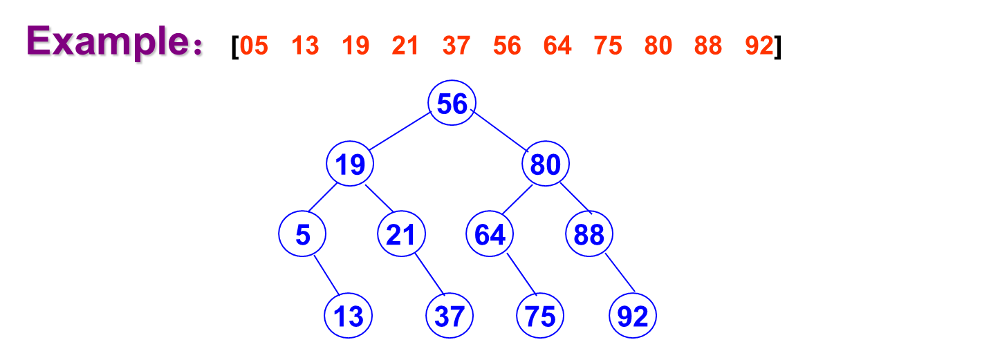
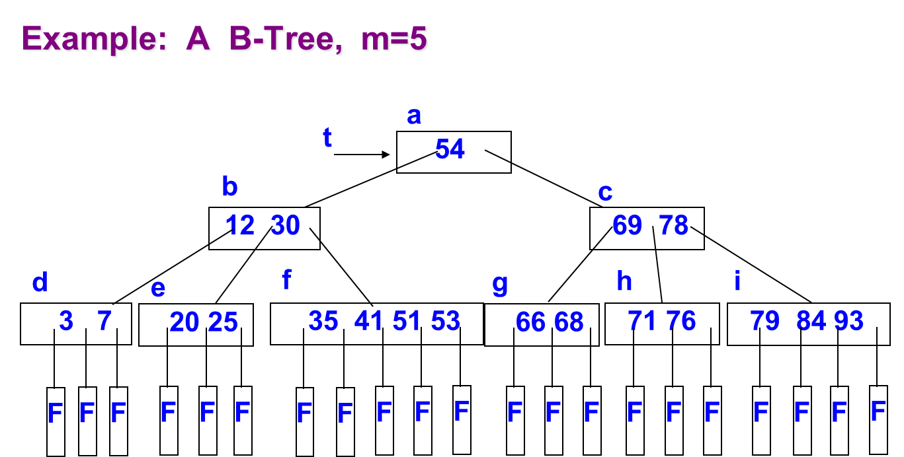

# CH9 Search 查找

-   Search Table  查找表
    -   Sequential Search  序列查找
    -   Binary Search  二分查找
    -   Indexing Search  索引查找
-   Binary Search Trees  二叉树搜索
    -   Binary search tree  二叉树查找
    -   AVL tree  AVL树
    -   B-Tree B树
-   Hash Table  哈希表
    -   What is hashing  
    -   Hash Function  哈希函数
    -   Collision Resolution  冲突解决
        -   Open Addressing  开放地址
        -   Rehashing  重散列
        -   Separate Chaining  分离链接法
    -   Analysis of Hashing  分析

## Search Table 查找表

-   Search Table: A set of the same type of data elements.   
    搜索表: 一组相同类型的数据元素。

    -   Key: The value of data item in the data element. It is used to identify the data elements.  
        Key: data 元素中数据项的值。用于标识数据元素。
    -   Primary Key and Second Key.  
        主键和第二键。
-   Attributes:  
    属性:

    -   There is no fixed relationship between the elements.  
        元素之间没有固定的关系。
    -   Any relationship can be defined on the set for operation convenience.  
        为了操作方便，可以在集合上定义任何关系。

-   Operations on search table  
    搜索表上的操作

    -   Search a given element in the search table;  
        在搜索表中搜索给定的元素;
    -   Get attributes of a given element;  
        获取给定元素的属性;
    -   Insert an element into the search table;  
        在搜索表中插入一个元素;
    -   Delete an element from the search table.  
        从搜索表中删除一个元素。

    >   Static search table: Only do search on the search table  
    >   静态搜索表: 只在搜索表上进行搜索
    >
    >   Dynamic search table: Need do search, insertion and deletion on the search table  
    >   动态搜索表: 需要在搜索表上进行搜索、插入和删除

### Sequential Search  顺序搜索

- General Idea: Begin at one end of the list and scan down it until the desired key is found or the end is reached.   
    总体思路: 从列表的一端开始，向下扫描，直到找到所需的键或到达末尾。
- A successful search return the position of the record; A unsuccessful search return 0.  
    成功的搜索返回记录的位置; 不成功的搜索返回0。

顺序查找又称线性查找，适用于顺序表和链表。对于顺序表，可通过数组下标递增顺序扫描每个元素；对于链表，可通过指针next来依次扫描每个元素。从线性表的一端开始，依次将记录的关键字与给定值进行比较，也就是逐个检查关键字是否满足给定的条件。若查找到某个记录的关键字和给定值相等，则查找成功；反之，查找失败。

序列可以无序

#### implement  实现

```c
#include <stdio.h>
#include <stdlib.h>
 
typedef char InfoType;
typedef int KeyType;
 
// 定义结构体ElemType，包含关键字域和其他域
typedef struct {
    KeyType key;        // 关键字域
    InfoType otherinfo;  // 其他域
} ElemType;
 
// 定义结构体SSTable，表示顺序表
typedef struct {
    ElemType* R;        // 存储空间基地址
    int length;         // 当前长度
} SSTable;
 
// 函数Search_Seq在顺序表ST中顺序查找关键字等于key的数据元素
int Search_Seq(SSTable ST, KeyType key) {
    int i = 0;
    ST.R[0].key = key;
    for (i = ST.length; ST.R[i].key != key; --i); // 从后往前查找
    return i;
}
 
int main() {
    // 假设KeyType是int，InfoType是char
    typedef int KeyType;
    typedef char InfoType;
 
    // 创建一个顺序表
    SSTable ST;
    ST.R = (ElemType*)malloc(10 * sizeof(ElemType)); // 假设分配10个元素的空间
    ST.length = 0;
 
    // 向顺序表中添加元素
    ST.R[1].key = 1;
    ST.R[1].otherinfo = 'A';
    ST.R[2].key = 2;
    ST.R[2].otherinfo = 'B';
    ST.length = 3;
 
    // 调用Search_Seq函数查找关键字为2的元素
    int position = Search_Seq(ST,2);
    if (position != 0) {
        printf("Element found at position %d\n", position);
        printf("%d", ST.R[position].otherinfo);
        putchar(ST.R[position].otherinfo);//将ASCII码转换为字符
    }
    else {
        printf("Element not found\n");
    }
 
    // 释放顺序表空间
    free(ST.R);
 
    return 0;
}
```

-   **Average Search Length(ASL)**
    $$
    ASL = p_1 c_1 + p_2 c_2 + \cdots + p_n c_n = \sum_{i=1}^n p_i c_i
    $$
    
-   analysis
    -   Successful search:
        -   best case: *1* comparison. 
        -   worst case: *n* comparisons.
        -   average case:    $ASL_{sq} = \sum_{i=1}^n p_i c_i = \sum_{i=1}^n p_i (n - i + 1) = \frac{n + 1}{2}$
    -   Unsuccessful search: *n+1* comparisons.
    -   Sequential search can be used for lists stored in arrays as well as for linked lists.  
        线性搜索可以用于存储在数组中的列表，也可以用于链接列表。


#### **哨兵的作用**

##### **(1) 消除越界检查**

在没有哨兵的情况下，需要每次检查是否越界。例如：

```python
for i in range(len(array)):
    if array[i] == target:
        return i
```

当列表中没有目标值时，必须遍历完整个列表并进行 n+1n+1n+1 次判断（包括最后的越界判断）。

**加入哨兵后**，将目标值作为一个临时元素放在列表末尾，不需要额外判断是否越界：

-   遇到哨兵时，算法会终止，而不需要检测是否越界。

##### **(2) 减少比较次数**

通过引入哨兵，减少了每次比较时的逻辑分支判断。哨兵确保只需要判断“当前值是否等于目标值”，避免了多余的“是否越界”的检查。

##### **(3) 提高代码简洁性**

使用哨兵后，查找代码逻辑更简单且更易维护。

### Binary Search  二分查找

有序列表——增删改仍要保持有序性

Binary search can be used for ordered lists stored in arrays.  
二进制搜索可以用于存储在数组中的有序列表。

不能用于链表（要找中间元素）

#### Idea: 思路

-   In searching an ordered list, first compare the target to the key in the center of the list.   
    在搜索有序列表时，首先将目标与列表中心的键进行比较。
-   If it is smaller, restrict the search to the left half; otherwise restrict the search to the right half, and repeat.   
    如果搜索范围较小，则将搜索限制在左半部分; 否则将搜索限制在右半部分，然后重复。
-   In this way, at each step we reduce the length of the list to be searched by half.  
    通过这种方式，在每个步骤中，我们将要搜索的列表的长度减少了一半。

#### Implementation: 实现

-   Keep two indices, *Low* and *High,* that will bracket the part of the list still to be searched.   
    保留两个索引，Low和High，它们将括起列表中仍要搜索的部分。
-   The target key will be found between the indices Low and High, inclusive.  
    目标关键字将在低指数和高指数之间找到，包括。

```c
// Binary Search Algorithm in C-style pseudocode
int binarySearch(KeyType K, ListType ST[], int n) {
    int Low = 0;                  // Initialize Low
    int High = n - 1;             // Initialize High (Length of list - 1)
    
    while (Low <= High) {         // Repeat until Low > High
        int mid = (Low + High) / 2; // Calculate mid (integer division)
        
        if (K < ST[mid].key) {    // If target key is smaller
            High = mid - 1;       // Search left half
        } else if (K > ST[mid].key) { // If target key is larger
            Low = mid + 1;        // Search right half
        } else {                  // Target found
            return mid;           // Return the index of the target
        }
    }
    
    return -1; // Target not found
}

```

#### Analysis  分析

-   Decision tree : The decision tree (also called comparison tree or search tree) of an algorithm is obtained by tracing the action of binary search algorithm, representing each comparison of keys by a node of the tree (which we draw as a circle).   
    决策树: 一个算法的决策树(也称为比较树或搜索树)是通过跟踪二进制搜索算法的行为而得到的，它用树的一个节点(我们画成一个圆)表示每个键的比较。
-   Branches (lines) drawn down from the circle represent the possible outcomes of the comparison. When the algorithm terminates, we put either F (for failure) or the location where the target is found at the end of the appropriate branch, and draw as a square.  
    从圆上划下的分支(线)表示比较的可能结果。当算法终止时，我们将 F (表示失败)或目标位置放在相应分支的末尾，并绘制为正方形。
-   The number of comparisons done by an algorithm in a particular search is the number of internal node traversed in going from the top of the tree down the appropriate path to a node.  
    一个算法在特定搜索中进行的比较的数量是从树的顶部沿着适当的路径到达一个节点时所遍历的内部节点的数量。



-   The depth of a decision tree $h = \lfloor \log_2 n \rfloor + 1$
-   $ASL = log_2(n+1)-1$   即   $O(log n)$

### Indexing Search  索引搜索

-   Data Structure：  
    数据结构:
    -   Divided a search list R[n] into b sublist. Each sublist may be not ordered by key, but the maximal key in the front sublist must be lower than the minimal key in the next successor list.  
        将搜索列表 R [ n ]分为 b 子列表。每个子列表可能不按键排序，但前面子列表中的最大键必须小于下一个后续列表中的最小键。
    -   A indexing table ID[b]. ID[i] stores the maximal key in i-th list. ID[b] is an ordered list.  
        索引表 ID [ b ] . ID [ i ] 将最大键存储在 i-th list 中。 ID [ b ] 是一个有序列表。

#### **核心概念**

1.  **分割搜索列表**：
-   将一个搜索列表 $R[n]$ 分成 $b$ 个 **子列表**。
    
-   子列表条件：
    
    -   每个子列表内部可以是无序的；
    -   但前一个子列表的最大关键字 **必须小于** 后一个子列表的最小关键字。

2.  **索引表（Indexing Table）**：

    -   构建一个索引表 $ID[b]$。
    -   索引表的第 $i$ 项 $ID[i]$ 存储第 $i$ 个子列表中的 **最大关键字**。
    -   索引表本身是一个 **有序列表**（按关键字排序）。


#### **工作流程**

##### **1. 索引构建（预处理阶段）**

-   将原始数据列表分割成若干子列表；
-   在每个子列表中找到最大值，存储到索引表 $ID[b]$；
-   对索引表进行排序，便于快速查找。

##### **2. 查找过程**

-   步骤 1：查找子列表：

    -   使用 **二分查找** 在索引表 $ID[b]$ 中定位目标关键字可能所在的子列表；

-   步骤 2：在子列表中查找：

    -   在定位到的子列表中执行 **线性查找** 或其他搜索方式以定位目标值。

#### Search Analysis 

-   $ASL = ASL_{indexing-tabel}+ASL_{Sublist}$

-   For search list of length n, it is divided into b  sublist and the length of a sublist is s = n/b  
    对于长度为 n 的搜索列表，它被划分为 b 子列表，子列表的长度为 s = n/b

    -   if using binary search in indexing table, the average search length will be  
        如果在索引表中使用二进制搜索，则平均搜索长度将为
        $$
        \log_2 \left( 1 + \frac{n}{s} \right) - 1 + \frac{s+1}{2}
        $$
        

    -   if using sequential search in indexing table, the average search length will be  
        如果在索引表中使用线性搜索，平均搜索长度将为
        $$
        \frac{b+1}{2} + \frac{s+1}{2} = \frac{s^2 + 2s + n}{2s}
        $$

### Searching comparison  比较

| Feature               | Sequential Search (顺序查找)    | Binary Search (二分查找) | Indexing Searching (索引查找)       |
| --------------------- | ------------------------------- | ------------------------ | ----------------------------------- |
| **ASL**               | Largest (最大)                  | Smallest (最小)          | Middle (中间)                       |
| **List Structure**    | Ordered, Unordered (有序，无序) | Ordered (有序)           | Ordered indexing table (有序索引表) |
| **Storage Structure** | Array, Linked List (数组，链表) | Array (数组)             | Array, Linked List (数组，链表)     |

## Binary Search Trees  二叉树搜索

### B- Tree  多路查找树  （索引表）

-   Goals of Indexing  索引的目标
    -   Store large files  
        存储大文件
    -   Support multiple search keys  
        支持多个搜索键
    -   Support efficient insert, delete, and range queries  
        支持高效的插入、删除和范围查询
-   Difficulties when storing tree index on disk:  
    在磁盘上存储树索引的困难:
    -   Tree must be balanced.  
        树木必须保持平衡。
    -   Each path from root to leaf should cover few disk pages  
        从根到叶的每条路径应该覆盖几个磁盘页
-   The B-Tree is now the standard file organization for applications requiring insertion, deletion, and key range searches.  
    B-Tree 现在是需要插入、删除和键范围搜索的应用程序的标准文件组织。

#### Definition 定义

1.  **B树的定义**
    -   一棵m阶的B树具有以下属性：
        1.  根节点要么是叶子节点，要么至少有两个子节点。
        2.  除根节点以外的每个节点都包含 $k−1$个值和 $k$ 个子节点，其中 $\lceil m/2 \rceil \leq k \leq m$。
        3.  所有叶子节点都位于树的同一层，因此这棵树总是高度平衡的。
2.  **B树节点设计**
    -   B树节点的大小通常被选择为与磁盘块的大小匹配。
    -   一个B树节点可能会有上百个子节点。

简单来说，B树是一种平衡多路查找树，适用于高效的磁盘存储和搜索操作。



孩子节点个数 - 1 = 父节点内元素个数（用父节点元素来分割子树）

-   F refers to failure node, which can be reached during a search only if the value, say x being searched for is not in the tree.   
    F 是指故障节点，只有当正在搜索的 x 值不在树中时，才能到达故障节点。
-   F 节点在值之间

#### Feature 特点

-   **B-Trees are always balanced.  
    树总是平衡的。**
-   B-Trees keep similar-valued records together on a disk page, which takes advantage of locality of reference.  
    B-树将相似值的记录放在一个磁盘页面上，这利用了访问局部性的优势。
-   B-Tree node is usually selected to match the size of a disk block.  
    通常选择 B-Tree 节点来匹配磁盘块的大小。
-   B-Trees guarantee that every node in the tree will be full at least to a certain minimum percentage. This improves space efficiency while reducing the typical number of disk fetches necessary during a search or update operation.  
    树保证树中的每个节点至少在一定的最小百分比内是满的。这提高了空间效率，同时减少了搜索或更新操作期间所需的磁盘读取的典型数量。

B-Tree Search
