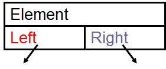
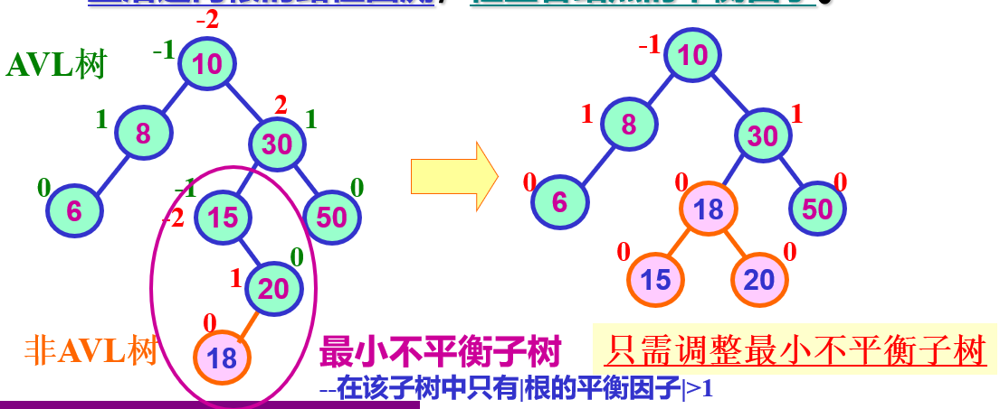

# 数据结构第一节

## 引入

- 课程信息
  
  - 郭三川
  - guosanchuan@Foxmail.com
  - 4学分 64 学时
  - 作业用c语言完成 pta平台
  - 周四 4-138 实验课

- 学习内容
  
  - 算法分析 时间空间复杂度
  
  - 抽象数据结构 链表 队列 ....
  
  - 字符串
  
  - 树 二叉树 优先队列
  
  - 图论 相关算法

- 相关书籍
  
  - data structures and algorithm analysis in C, second edition, pearson education
  
  - 严蔚敏 《数据结构》(清华大学）

- 什么是数据结构
  
  - 问题-->数学模型-->算法-->程序-->结果
  
  - 科学计算+非科学计算

## terminologies 术语

- 数据 data

- 数据元素 data element

- 数据项 data item 

- 数据对象 data object 

## 结构 structure

### 结构分类 structural classification

- logic structure 逻辑结构
  
  - set 集合
  
  - Linear 线性
  
  - tree 树型结构
  
  - graphic 图

- physical structure 物理结构
  
  - 依据逻辑结构的算法设计

### 顺序存储结构 sequential storage structure

- 例子：数组

### 链式存储结构 linked storage structure

- 使用指针去寻找相关数据元素

## data type 数据类型

### c语言的数据类型

- atomic：integral、float、...

- structural（结构体）：can be divided further 

### abstract data types (ADTs) 抽象数据类型

- A specification of a set of data and the set of operations that can be performed on the data. Such a data type is abstract in the sense that it is independent of various concrete implementations.
  一组数据和可以对数据执行的一组操作的规范。这种数据类型是抽象的，因为它独立于各种具体实现。

```ADTs
ADT ADT name
Data 
    structure on data elements
operation
    operation 1
        initial conditions
        actions
    operation 2
        initial conditions
        action
endADT
```

## algorithm & algorithm analysis 算法与算法分析

- 数据结构+算法 = 程序
- Data Structures:  Methods of organizing large amounts of data for nonnumeric calculation.   
  数据结构：组织大量数据进行非数值计算的方法；
- Algorithm : A finite, clearly specified sequence of instructions to be followed to solve a problem.   
  算法：为解决问题而遵循的有限、明确指定的指令序列。
- Algorithm Analysis: The estimation of the running time/space of algorithms.  
  算法分析：算法运行时间/空间的估计

## algorithm features 算法的特点

- input 输入

- output 输

- definiteness 确定性

- finiteness 有穷性

- effectiveness 有效性

## algorithm requirement 算法需求

- correctness 正确性
  
  - 无语法错误
  
  - 对合法/非法输入的预期输出
  
  - 选择性输入的预期输出（边界条件）

- readability 可读性
  
  - 易读、易理解、可交流

- robustness 鲁棒性；稳健性
  
  - 可以处理非法输入

- High efficiency 高效性
  
  - 运行时间
  
  - 储存管控

# 数据结构第二节

- What to Analyze ? 要分析什么？

- Running Time Analysis  运行时间分析

- General Rules  通用规则

- Recursive Calls  递归调用

- Maximum Subsequence Sum Problem  最大子序列求和问题

- Experimentally checking analysis  实验检查分析

## 要分析什么 What to Analyze

1、机器、编译器 与运行时间相关

2、时间、空间复杂度 与 机器、编译器 独立

（预先假设：1、顺序执行；2、简单指令，执行单位时间；3、整形的大小固定，内存无限大）


用T(N)表示算法执行时间

$T_{avg}(N)$  &  $T_{worst}(N)$  平均和最差时间复杂度 average and worst case time complexities


- EXP
  
  - algorithm 1    $T_{sum}(N) =2n+3$
    
    ```c
    int i, sum = 0, n = 100; // 1 step
    for (i = 1; i <= n; i++)    //  n+1 steps
    {        
        sum =  sum + i;     //  n steps
    } 
    printf (“%d”, sum);      //  1 step 
    ```
  
  - algorithm 2      $T_{sum}(N) =3$
    
    ```c
    int sum = 0, n = 100;    // 1 step
    sum =  (1 + n ) * n/2;    // 1 step
    printf (“%d”, sum) ;     // 1 step 
    ```
    
    

## 运行时间分析 Running Time Analysi

Empirical --> after implementation 实证-->实施后

Theoretical -->before implementation  理论-->实施前

- 使用渐近表示法（ asymptotic notations）—— O, Ω, θ, o
  
  - compare relative growth 比较相对增长
  
  - independent of platform  独立于平台

- Definition (略)
  
  - $T (N) = O( f (N) )$
  
  - $T (N) = \Omega( g(N) ) $
  
  - $T (N) = \theta( h(N) ) $
  
  - $T (N) = o( p(N) ) $

- $T (N) = O( f (N) )$
  
  - EXP：$O(3n^3+4n^2 +5) = O(n^3)$  
  
  - STEP:
    
    - Count the steps  to get T(n)  
    
    - Simplyfy $T(N)$       
      Lower-order terms are ignored        
      Drop the constants 
    
    - Get f(n)       
      $T(n) = O ( f(n) )$  
    
    - Compare between algorithms

- Compare 比较
  $O(1) < O(logn) < O(n) < O(nlogn) < O(n^2) < O(n^3) < O(2^n) < O(n!) < O(n^n) $ 
  
  

## 通用规则 General Rules （时间复杂度）

### Constant order 常数阶

```c
int sum = 0, n = 100;    // 1 step
sum =  (1 + n ) * n/2;    // 1 step (or 4 step ✓) 
printf (“%d”, sum) ;     // 1 step  
```

        $T_N   = O(3) = O(1) $ 

### Linear order 线性阶

```c
int i; for (i = 0; i < n; i++) 
{ 
    /*execution steps of O(1) */ 
} 
```

        $T_N   = O(N)  $

### Log order 对数阶

```c
int count = 1;
 while (count < n) {
    count = count * 2;      
    /*execution steps of O(1) */ 
} 
```

        $2^X=n \ge x=log_2n$

        $T_N = O(logn)$ 

### Square order 平方阶

- 1
  
  ```c
  int i j;
  for (i = 0; i < n; i++){      
      for (j = 0; j < n; j++){           
          /*execution steps of O(1) */       
      } 
  } 
  ```
  
  $T_N   = O(N^2)  $

- 2
  
  ```c
  int i j;
  for (i = 0; i < m; i++) {
        for (j = 0; j < n; j++){
            /*execution steps of O(1) */       
      } 
  }
  ```
  
          $T_N   = O(m \times n)  $

- 3
  
  ```c
  int i j;
  for (i = 0; i < n; i++){
      for (j = i; j < n; j++){
          /*execution steps of O(1) */   
      }
  } 
  ```

                $T  (N) = n + (n-1) + (n-2) +…+1= (n^2+n)/2 = O(n^2)  $

### 并列语句 $T_1 (N) + T_2 (N)$

- 并列语句直接加

- 加完$O(f(n))$ 取最高次项

### 条件判断 If / Else

- 运行时间不得超过测试运行时间加上S1和S2运行时间中的较大值

- $T(n) ≤ T_3(n) + max (T_1(n), T_2(n))$

- 

## 递归调用 Recursive Calls

- 设这一次和下一次的用时为 $T(n)$ 和 $T(n-1)$

- ```c
  int factorial (int n) {
  if (n<=1)         //1 for if
      return 1;
  else              //1 for else
      return n*factorial(n-1); //1 for multiplication + 1 for substraction + cost of evaluation of factorial(n-1)  
  } 
  ```

- $T(n)= 4 + T(n-1)$ 且 $T(1)= 2$ 

- 逐步归纳得出结果

- 双调用递归形式
  
  - ```c
    Fib (int N) {
      if (N<=1)         
        return 1;     
    else         
        return Fib(N-1)+Fib(N-2); 
    } 
    ```
  - $T(N) = T(N-1) + T(N-2) + 2 \ge  Fib(N) $ 
  - $(\frac{3}{2})^N \le Fib(N) \le (\frac{5}{3})^N$ 

## 最大子序列求和问题 Maximum Subsequence Sum Problem

- Given (possibly negative) integers $A1, A2, …, A_N$ find the maximum value of $ {\textstyle \sum_{k=i}^{j}} A_K$ 

### 算法1

```c
int  MaxSubsequenceSum ( const int A[],  int  N ) { 
    int  ThisSum,  MaxSum,  i,  j,  k; 
    MaxSum = 0;   /* initialize the maximum sum */
       for( i = 0; i < N; i++ ){ /* start from A[ i ] */
           for( j = i; j < N; j++ ) {   /* end at A[ j ] */
               ThisSum = 0; 
               for( k = i; k <= j; k++){
                   ThisSum += A[k];  /* sum from A[ i ] to A[ j ] */
                   if ( ThisSum > MaxSum)  MaxSum = ThisSum;  /* update max sum */
               }
           }  /* end for-j and for-i */
       }
     return  MaxSum; 
} 
```

- $T( N) = O( N^3 )$ 

### 算法2

```c
int  MaxSubsequenceSum ( const int A[],  int  N ) { 
    int  ThisSum,  MaxSum,  i,  j; 
    MaxSum = 0;   /* initialize the maximum sum */
    for( i = 0; i < N; i++ )  {   /* start from A[ i ] */
           ThisSum = 0; 
           for( j = i; j < N; j++ ) {   /* end at A[ j ] */
                ThisSum += A[ j ];  /* sum from A[ i ] to A[ j ] */
                 if ( ThisSum > MaxSum ) MaxSum = ThisSum;  /* update max sum */
          }  /* end for-j */
      }  /* end for-i */
      return  MaxSum; 
} 
```

- $T( N ) = O( N^2 )$ 

### 算法3 ——「分治算法」（Divide and Conquer）

在C语言中，可以使用「分治算法」（Divide and Conquer）来解决最大子序列和问题。这个问题的目标是找到一个数组中具有最大和的连续子序列。分治法的思路是将问题分成左右两部分，递归解决子问题，并结合左右部分的结果来找到最终解。

#### 算法的关键思想：

1. 将数组分成左右两部分，分别求解左边的最大子序列和右边的最大子序列。
2. 同时要考虑跨越左右部分的子序列，它可能是最大子序列。
3. 返回以上三者中最大的值。

#### 算法的步骤：

- 将数组从中间分成两半。
- 分别递归地找到左半部分和右半部分的最大子序列和。
- 计算跨越中间的子序列的最大值。
- 返回三者中的最大值。

#### C语言实现：

```c
#include <stdio.h>
#include <limits.h>

// 辅助函数，计算跨越中间的子数组的最大和
int maxCrossingSum(int arr[], int left, int mid, int right) {
    int sum = 0;
    int left_sum = INT_MIN;

    // 从中间向左扫描，找出最大左边子序列和
    for (int i = mid; i >= left; i--) {
        sum += arr[i];
        if (sum > left_sum) {
            left_sum = sum;
        }
    }

    // 从中间向右扫描，找出最大右边子序列和
    sum = 0;
    int right_sum = INT_MIN;
    for (int i = mid + 1; i <= right; i++) {
        sum += arr[i];
        if (sum > right_sum) {
            right_sum = sum;
        }
    }

    // 返回跨越左右的最大子序列和
    return left_sum + right_sum;
}

// 分治法求最大子序列和
int maxSubArraySum(int arr[], int left, int right) {
    // 基本情况：如果数组只有一个元素
    if (left == right) {
        return arr[left];
    }

    // 找到中间点
    int mid = (left + right) / 2;

    // 递归求解左边、右边和跨越中间的最大子序列和
    int left_sum = maxSubArraySum(arr, left, mid);
    int right_sum = maxSubArraySum(arr, mid + 1, right);
    int cross_sum = maxCrossingSum(arr, left, mid, right);

    // 返回三者中的最大值
    if (left_sum >= right_sum && left_sum >= cross_sum) {
        return left_sum;
    } else if (right_sum >= left_sum && right_sum >= cross_sum) {
        return right_sum;
    } else {
        return cross_sum;
    }
}

int main() {
    int arr[] = {2, 3, 4, -1, -2, 1, 5, -3};
    int n = sizeof(arr) / sizeof(arr[0]);

    int max_sum = maxSubArraySum(arr, 0, n - 1);

    printf("最大子序列和是: %d\n", max_sum);

    return 0;
}
```

#### 解释：

1. **`maxCrossingSum` 函数**：用于计算跨越数组中间的子数组的最大和。它从中间向左右两边扩展，分别计算左右两部分的最大子序列和，然后将两者相加得到跨越的最大子序列和。
2. **`maxSubArraySum` 函数**：递归地求解左半部分、右半部分和跨越中间的最大子序列和，返回这三者的最大值。
3. **`main` 函数**：定义数组并调用 `maxSubArraySum` 来求解整个数组的最大子序列和。

    该代码成功求解了最大子序列和问题，时间复杂度为 O(n log n)。


### 算法4 —— **On-line Algorithm** 在线算法

**On-line Algorithm**，即在线算法，指的是一种能够逐步处理输入数据并且在每一步做出决策的算法。相比于一次性获取所有数据后再做决策的离线算法，在线算法更适合处理流式数据或未知长度的数据流。在线算法在遇到数据的每一步时，需要立即做出最优的决策，通常不能回溯到之前的数据进行修改。

对于最大子序列和问题，使用**在线算法**可以通过**Kadane's Algorithm**（卡丹算法）来实现。这个算法的核心思想是在遍历数组的过程中逐步更新最大子序列和，时间复杂度为 O(n)，是一种经典的在线算法。

#### 思路：

1. 从数组的第一个元素开始，逐步遍历每一个元素。
2. 对于每个元素，更新当前的子序列和（`current_sum`），如果当前和小于 0，则丢弃当前和，重新开始计算（从下一个元素开始一个新的子序列）。
3. 在每一步都更新最大子序列和（`max_sum`）。

#### 关键点：

- **current_sum**：当前子序列的和。表示到目前为止的子序列和，如果 `current_sum` 小于 0，那么丢弃它并从当前元素重新开始。
- **max_sum**：记录迄今为止遇到的最大子序列和。

#### C 语言实现：

```c
#include <stdio.h>
#include <limits.h>

int maxSubArraySum(int arr[], int n) {
    int max_sum = INT_MIN;  // 存储最大子序列和
    int current_sum = 0;    // 当前子序列和

    for (int i = 0; i < n; i++) {
        current_sum += arr[i];   // 加上当前元素

        if (current_sum > max_sum) {
            max_sum = current_sum;  // 更新最大子序列和
        }

        if (current_sum < 0) {
            current_sum = 0;  // 如果当前和为负数，抛弃当前和，重新开始
        }
    }

    return max_sum;
}

int main() {
    int arr[] = {2, 3, -6, 1, 2, 3, -4, 2, 5};
    int n = sizeof(arr) / sizeof(arr[0]);

    int max_sum = maxSubArraySum(arr, n);

    printf("最大子序列和是: %d\n", max_sum);

    return 0;
}
```

#### 解释：

1. **`maxSubArraySum` 函数**：
   
   - 遍历数组中的每一个元素。
   - 使用 `current_sum` 累加当前的子序列和，并在每一步检查是否需要更新 `max_sum`。
   - 如果 `current_sum` 变成负数，说明当前子序列不再有贡献，因此将 `current_sum` 重置为 0，从下一个元素重新开始计算。

2. **`main` 函数**：定义了一个数组并调用 `maxSubArraySum` 来求解数组的最大子序列和。

#### why？丢弃

在 Kadane's Algorithm 中，当当前子序列和（`current_sum`）小于 0 时，我们选择丢弃当前和，重新从下一个元素开始计算，这是因为：

##### 1. **负数只会拖累后续的计算**

   如果当前的子序列和为负数，并且我们继续把它加到后续的元素上，这会导致后续的子序列和变得更小，无法获得更大的子序列和。换句话说，一个负的子序列和对后续的子序列没有任何帮助，反而会降低它们的值。

##### 2. **负数的累积没有正贡献**

   假设当前子序列的和小于 0，那么不论接下来遇到什么样的元素（无论是正数还是负数），加上一个负的 `current_sum` 都只会使得新子序列的和变小。此时不如丢弃负数的和，从下一个元素重新开始累加，从而增加子序列和的可能性。

##### 3. **重新开始的子序列更有可能获得最大和**

   当 `current_sum` 小于 0 时，直接从下一个元素开始重新累加相当于开始了一个新的子序列。这意味着我们认为前面的子序列（因为是负数）对后续没有帮助，而希望从新的元素开始，看看能否找到更大的子序列和。

##### 4. **保证全局最优解**

   Kadane’s Algorithm 的设计思路是通过每一步局部的最优选择来保证全局的最优解。当子序列和小于 0 时，丢弃它相当于做出了局部最优的选择：不让负数影响到后面的子序列，从而提升整体的最大和。

#### 总结

当当前子序列和小于 0 时，丢弃它是因为负数只会降低后续子序列的值，无法产生任何正面的贡献。通过从下一个元素重新开始计算，我们可以避免负数的累积带来的负面影响，从而增加找到最大子序列和的机会。这种做法保证了 Kadane's Algorithm 能够在每一步做出局部最优选择，最终得到全局最优解。

##### 在线算法的优点：

- **空间复杂度为 O(1)**：Kadane’s Algorithm 只需要常数空间，因为它只维护了 `current_sum` 和 `max_sum` 两个变量。
- **时间复杂度为 O(n)**：Kadane’s Algorithm 只需要一次遍历数组，因此时间复杂度是线性的，非常高效。
- **适合动态输入**：如果数据是动态到达的（即流式数据），Kadane’s Algorithm 能够在每一步实时更新结果，因此它是一个在线算法的经典例子。

##### 在线算法的使用场景：

- **流式数据处理**：Kadane's Algorithm 适合处理动态输入数据，能够在数据不断变化或增加时持续计算最大子序列和。
- **实时计算问题**：当你不能提前知道所有输入数据时，在线算法能随着数据的到来不断更新最优解。

## 实验检查分析 Experimentally checking analysis

### method 1

Implement your algorithm, measure therunning time of your implementation

实现你的算法，测量实现的运行时间
     When N doubles (2x), check T(2N)/T(N) 
     linear       => T(2N)/T(N)  2 
     quadratic    => T(2N)/T(N)  4 
     cubic        => T(2N)/T(N)  8

### method 2

$T_t (N)$  = theoretical running time

$T_e (N)$= experimental running time 

- $T_t(N) = O(f(N))$  $\frac{T_e(N)}{T_f(N)}\Rightarrow \frac{T_E(N)}{f(N)}$ 

- compute
  
  - if converges to a constant  $\Rightarrow $ f(N) is a tight bound 
  
  - if converges to zero  $\Rightarrow $   not tight bound (overestimate) 
  
  - if diverges   $\Rightarrow $   underestimate 

# 数据结构第四节——CH3 Linear Lists

- List ADT

- Linear List 线性表
  
  - Array list 数组
  
  - Linked list 链表
  
  - Cursor List 基于数组管理内存的链表
  
  - Doubly Linked List 双向链表

## Linear List 线性表

A linear List is a list in which each element has a unique successor. 

线性列表是一个列表，其中每个元素都有一个唯一的后继元素。

- $A_i$+1 follows (succeeds) $A_i$, $A_i$ precedes Ai.

- Position of element $A_i$ = I 

- List of size 0 is empty list 

### List ADT Operations 抽象数据类型操作表

- List MakeEmpty( List L )    清空列表

- int  IsEmpty( List L)  判断线性表是否为空

- int  IsLast( Position P, List L)  判断P位置是否为线性表最后一位

- void Insert ( ElementType X, List L, Position P )    在位置P后插入
  
  - Insert(X, L, 3)  ->    (34,12,52,X,16,12) 

- void Delete ( ElementType X, List L )         
  
  - Delete(52, L)    ->    (34,12,X,16,12)      //e.g. list 

- Position Find ( ElementType X, List L )     
  
  - Find(16)     ->　4 

- ElementType Retrieve( Position P )  
  
  - Retrieve(3)    ->    X 

- Position FindPrevious( ElementType X, List L )    
  
  - FindPrevious (12, L )  -> 4  

### Types of Lists 线性表的类型

#### General:  data can be inserted and deleted anywhere in the list  常规：可以在列表中的任何位置插入和删除数据

- Array List 数组

- Linked List  链表

- Cursor List  游标线性表

- Doubly Linked List  双向链表

- Circularly Linked List  环链表

#### Restricted:  data can be inserted or deleted at the ends of the list  限制：可以在列表末尾插入或删除数据

- Last-In-First-Out (Stack)  后进先出（栈）

- First-In-First-Out (Queue)  先进先出（队列）

### Array List 顺序表（数组）

- Elements are stored contiguously in memory as an array (easy to find kth element) 元素作为数组连续存储在内存中（容易找到第k个元素）

- Simple array implementation 简单的阵列实现
  
  - Must know estimate of size before hand (waste of space) 必须事先知道尺寸估计（浪费空间）
  
  - Insert and Delete: expensive  插入和删除：昂贵

| 0            |               |
| ------------:|:-------------:|
| 1            | element[1]    |
| 2            | element[2]    |
| 3            | Element[3]    |
|              | ……            |
| 1 ≤ i ≤ last | element[i]    |
|              | ……            |
|              | ……            |
| last         | element[last] |
|              | ……            |
| maxlength-1  |               |

```c
//Type Definition： 类型定义
# define maxlength 100 
struct LIST {      
    elementtype * elements;
    int last; 
}; 
//Position Type：重定义
    typedef int position; 
//Linear List L: 声明结构
    struct LIST L; 
//Initialization: 初始化
    L.elements= (elemttype *)  malloc  (maxlength* sizeof (elemttype))  
//Representation：调用
    L.elements[p] // pth element       
    L.last // length of L, position of last element 
```

#### 插入（前插） Array list-INSERT Operation

```c++
 void Insert (int newItem, List &L, int location) {       
     int i;       
     if (L.last + 1 == maxlength) {//array is full 数组已满          
         int *b = new int[2 * maxlength]; // Allocate a new array, twice as long. 分配一个新数组，长度是原来的两倍。
         for (i = 0; i <= L.last; i++) {// Copy items to the bigger array.将项目复制到更大的数组。
             b[i] = L.elements[i];           
         }       
         L.elements = b; // Replace the too-small array with the new one.用新的阵列替换太小的阵列。
     }       
     for (i = L.last; i >= location; i--) { // Shift items to the right.将项目向右移动。
         L.elements[i + 1] = L.elements[i];       
     }      
     L.elements[location] = newItem;      
     L.last++; 
 }//Time Complexity 时间复杂度：O(n) 
```

#### 删除 Array list-DELETE Operation

```c
 void Delete( Element X, LIST &L) {   
     position i, q ;     
     for (  i= 0 ; i <= L.last ; i ++ ){          
         if ( L.elements[ i ] == X ){    
             q = i;//find the position of X          
             break;          
         }     
     }     
     if ( i == L.last+1)// X found or not?
        error (not found X)；     
     else{             
         L.last = L.last – 1;          
         for ( i = q ; i < L.last ; i ++ ){        
             L.elements[ i ] = L.elements[ i + 1 ]; //move all elements       
         } 
     }//Time Complexity：O(n) 
```

#### 查找 Array list-Find and Retrieve Operations

- 查找数据元素
  
  ```c
  position Find ( elementtype x ,LIST L ) {   
    position q ;     
    for ( q = 1; q <= L.last ; q++ )     
        if ( L.elements[ q ] == x )         
            return ( q ) ;         
    return ( L.last + 1 ); 
  }  //Time Complexity O(n) 
  ```

- 查找某一位置上的数据
  
  ```c
  elementtype Retrieve ( position p ,LIST L ) {  
      if ( p > L.last )         
          error( illegal position) ;     
      else
          return ( L.elements[ p ] ) ; 
  }   //Time Complexity O(1) 
  ```

### Linked List 链表

- 定义
  
  ```c
  //Type definition： 
  struct celltype { 
      elementtype element ; 
      struct celltype *next ; 
  } ; /*Node Type*/ 
  /*List Type */ 
  typedef struct celltype *LIST; 
  /*Position Type*/ 
  typedef struct celltype *position; 
  ```

- special ATTENTION！！！
  
  ```c
  struct celltype *LIST;//指针
  struct celltype &LIST;//地址
  struct celltype LIST;//对象
  ```

#### 查找和检索 Linked list-Find and Retrieve Operations

```c
position Find ( elementtype x, LIST L ) {  
    position p ;     
    p = L->next ; //pass the pointer to first item 将指针传递到第一个项目
    while ( p != NULL && p ->element != X  ){
        p = p→next ;     
        return p ;
    } 
} //Time Complexity：O(n) 
```

```c
elementtype Retrieve ( position p , LIST L ) {     
    return ( p →element ); 
} //Time Complexity：O(1) 
```

#### 插入 Linked list-INSERT Operations


```c
void Insert ( elementtype x, position p, LIST &L ) {
    position q ;     
    q = new celltype ;     
    q →element = x ;     
    q →next = p →next ;     
    p →next = q ; 
} //Time Complexity O(1) 
```

#### 删除 Linked list-DELETE Operation


```c
void Delete (Element X, LIST &L ) {  
    position P, TmpCell ;    
    p = FindPrevious( X, L ) ;      
    if ( !IsLast( P, L ) ) {//not the last element            
        TmpCell = P->Next;         
        P->Next = TmpCell->Next;         
        free ( TmpCell );      
    }  
} //Time Complexity：O(1)  
```

### 顺序表和链表对比 Array List vs. Linked List

|                                 | Array List                                                           | Linked List                                        |
|:-------------------------------:| -------------------------------------------------------------------- | -------------------------------------------------- |
| Findkth operation 查找操作          | Random Time efficient O(1)                                           | Sequential Time inefficient  O(n)                  |
| Insert/Delete Operation 插入/删除操作 | Time inefficient O(n)                                                | Time efficient O(1)                                |
| Space 空间                        | Estimated size, Fixed, waste space, hard to expand 估计大小，固定，浪费空间，难以扩展 | Actual size, Flexible, easy to expand 实际尺寸，灵活，易于扩展 |

### Cursor List 静态链表（游标链表）——基于数组管理内存的链表

- 每一位置一数据一下标（输入下标静态表开始检索，检索到下标到-1静态表终止）

- 手动模拟malloc和free函数的操作，操作“available”表确定空地址

#### Representation & Definition


```c
//Type Definition： 
typedef struct {     //数组的每一项用结构体实现
    elementtype element ;     //要存储的数据类型
    int next ;         //表内下一个元素的下标
} spacestr; /*Node Type*/  
spacestr SPACE[ maxsize ] ;/*Memory pool*/  //结构体数组
typedef int position，cursor; 
cursor av; /*cursor variable, label a liner list*/  
SPACE[i].next /*position of next element */ 
```

#### GetNode and FreeNode 获取和释放节点

```c
//get an unallocated node 获取节点
cursor GetNode(){      //malloc
    cursor p;    
    if (SPACE[available].next ==-1)        
        p=-1;    
    else{   
        p= SPACE[available].next ;        
        SPACE[available].next = SPACE[ p ].next ;    
    }     
return p; 
} 
```

```c
//free node  释放节点
void FreeNode(cursor q){  //delete q;      //free
    SPACE [ q ].next = SPACE[available].next ;     
    SPACE[available].next = q ; 
} /* free node to the pool*/ 
```

### Doubly-linked list 双向链表

#### 初始化

```c
struct dcelltype { 
    elementtype element ; 
    struct dcelltype *next, *previous ; 
} ; /* list and  position type*/ 
typedef struct dcelltype *DLIST ; 
typedef struct dcelltype *position ; 
```

#### Doubly-linked listINSERT and DELETE 双向链表的插入和删除

```c
//insert at position p 
void INSERT( elementtype x, position p,DLIST &L ) {     
    position q ;     
    q = new dcelltype ;     
    q→element = x ;     
    p→previous→next = q ;     
    q→previous = p→previous ;     
    q→next = p ;     
    p→previous = q ; 
} 
```

```c
//delete node at position p 
void DELETE(  position p, DLIST  &L ) {       
    if (p->previous!=NULL)             
        p→previous→next = p→next;       
    if (p→next!=NULL)             
        p→next →previous = p→previous ;       
    delete p; 
} 
```

### Circularly Linked List 循环链表


### Circularly Doubly Linked List 双向循环链表


# 数据结构第五节——CH4 Stacks and Queues 栈和队列

- Stack 
  
  - Stack Model 
  
  - Implementation of Stacks 
  
  - Applications 

- Queue 
  
  - Queue Model 
  
  - Implementation of Queues
  
  - Applications    

## Stack 栈

- Definition：A stack is a Last-In-First-Out (LIFO) list, that is, an ordered list in which insertions and deletions are made at the top only. 堆栈是后进先出（LIFO）列表，即一个有序列表，其中仅在顶部进行插入和删除。

- 输入输出
  
  - Input   push() 
  
  - Output   pop() 


### Operations 操作

1. Int  IsEmpty( Stack S );  

2. Stack CreateStack( );   

3. MakeEmpty( Stack S );   

4. Push( ElementType X, Stack S );    //压栈Push

5. ElementType  Top( Stack S );   

6. Pop( Stack S );  //弹栈Pop
- 栈的常见错误 Note:  
  
  - Underflow:A Pop (or Top) on an empty stack is an error in the stack ADT.
    空堆栈上的Pop（或Top）是堆栈ADT中的错误。
  
  - Overflow: Push on a full stack is an implementation error. 
    推送完整堆栈是一个实现错误。

### Linked List Implementation 用链表实现

链表头

```c
struct node; 
typedef struct node * PtrToNode; 
typedef PtrToNode Stack;  
struct node {     
    ElementType element;     
    PtrToNode next; 
}; 
```


#### CreateStack 创建栈

```c
Stack createStack() {   
    Stack s;      
    s = malloc (sizeof (struct Node ));     
    if (s==NULL) {         
        printf(“Out of space!!”);     
    }     
    s->next = NULL;     
    return s; 
} 
```

#### isEmpty 判断为空

```c
int isEmpty(Stack s) {     
    return s->next == NULL; 
} 
```

#### MakeEmpty 置空

```c
void makeEmpty(Stack s) {     
    if (s == NULL) {         
        printf(“Must use CreateStack first”);     
    } else {         
        while (!isEmpty(s)) {             
            pop(s);         
        }     
    } 
} 
```

#### Pop 弹栈/出栈

```c
void pop (Stack s) {     
    PtrToNode first;      
    if (isEmpty(s)) {         
        printf(“empty stack”);     
    } else {         
        first = s->next;         
        s->next = s->next->next;         
        free(first);     
    } 
} 
```

#### Push 压栈

```c
void push (ElementType x, Stack s) {     
    PtrToNode = temp;      
    = malloc(sizeof(structNode));     
    if (temp == NULL) {         
    printf(“out of space!!”);     
    } else {         
        temp->element = x;         
        temp ->next = s->next;         
        s->next = temp     
    } 
} 
```

#### Top 头元素

```c
ElementType top(Stack s) {
    if (!isEmpty(s)) {
        return s->next->element;
    }
    printf(“Empty stack”);
    return 0;
}
```

### Array implementation 数组实现

```c
struct  StackRecord {     
    int Capacity ;              /* size of stack */     
    int TopOfStack;          /* the top pointer */     
    /* ++ for push, -- for pop, -1 for empty stack */                         
    ElementType *Array;    /* array for stack elements */  
} ;  
```

- Popular implementation (v.s. Linked list implem.), why? 优势
  
  - Takes  fast constant time (specific instruction) 
  
  - Actual stacks usually not large (no waste of space) 

- Note  注意
  
  - Error checking before push or pop  

### EXP 运用实例

#### Balancing Symbols 平衡符号检查

- Balancing symbols: Check if parenthesis ( ), brackets [ ], are balanced.
  平衡符号：检查括号（）、括号[]是否平衡。

##### 流程

- Keep a stack 

- Read the charecters one by one  逐一阅读字符

- If the charecter is ‘(‘  or ‘[‘ push into stack 如果字符是“（”或“[”，则推入堆栈

- If the charecter is ‘)’ or ‘]’ pop the stack  如果字符是“）”或“]”，则弹出堆栈
  
  - if the stack is empty ERROR     
  
  - if the symbol popped does not match with character ERROR 

- Continue until the end of file 继续，直到文件结束

- At the end of file     
  
  - if  the stack is not empty ERROR        
  
  - else SUCCESS 

##### code 代码

```c
Algorithm  {
    Make an empty stack S;
    while (read in a character c) {
        if (c is an opening symbol)
            Push(c, S);
        else if (c is a closing symbol) {
            if (S is empty)  { ERROR; exit; }
            else  {  /* stack is okay */
                if  (Top(S) doesn’t match c)  { ERROR, exit; }
                else  Pop(S);
            }  /* end else-stack is okay */
        }  /* end else-if-closing symbol */
    } /* end while-loop */ 
    if (S is not empty)  ERROR;
}
```

#### Postfix Evaluation 后缀表达式的评估（机器计算）

1. 数学上常用的表达式叫做中缀表达式，需要用括号来表示运算顺序，但是计算机做中缀表达式的求值比较难，一是需要知道运算符优先级，二是需要处理括号  

2. 为了方便计算机进行求值，我们引入了前缀表达式和后缀表达式。

3. 后缀表达式更加简单，他有一个特性，就是我们从左到右扫描表达式，如果遇到操作符，那么他的两个操作数一定已经ready了，可以进行这个操作符所对应的运算。由于这样的性质，我们可以使用堆栈来解决后缀表达式求值问题 
- 〖Example〗
  
  - An infix expression 中缀表达式:     a + b * c - d / e                       
  - A prefix expression 前缀表达式:     - + a * b c / d e                      
  - A postfix expression 后缀表达式（逆波兰表示）:   a b c * + d e / - 


#### Infix to Postfix Conversion 从前缀到后缀的转换

- 栈里只放运算符，在下一个运算符的优先级判断后，优先级比读取的低或等时，出栈（一直出栈）并输出（括号不输出），优先级比读取的高时，压栈

- 左括号栈外优先级最高，栈内优先级最低

##### 〖Example1〗  a + b * c - d  =  ?

1. Read one by one.

2. If it is not symbol,  output as part of the postfix expression.

3. else compare with the symbol at top of the stack.
   
   - If its precedence is lower than or equal to the top symbol or it is“)”,pop the symbol from top, output it, until a entry of lower priority,and push the current symbol.
     如果其优先级低于或等于顶部符号或为“）”，则从顶部弹出符号，输出它，直到优先级较低的条目，然后推送当前符号。
   
   - else push the current symbol into stack.
     否则，将当前符号推入堆栈。

##### Tips 括号的处理:

- Never pop a ( from the stack except when processing a ) .
  永远不要弹出a（从堆栈中弹出，除非处理a）。

- Observe that when (  is not in the stack, its precedence is the highest; but when it is in the stack, its precedence is the lowest.  Define in-stack precedence and incoming precedence for symbols, and each time use the corresponding precedence for comparison.
  请注意，当（不在堆栈中时，其优先级最高；但当它在堆栈中，其优先级最低。定义符号的堆栈内优先级和传入优先级，每次使用相应的优先级进行比较。
  (in other words, “(” must be pushed, and when meet “)”, symbols in stack above “(” are poped) 
  （换言之，“（必须被推，当遇到时）”，上面堆栈中的符号“（”被弹出）

##### Note 嵌套次方的处理：

- a – b – c will be converted to a b – c –.  However, 2^2^3 must be converted to 2 2 3 ^ ^, not 2 2 ^ 3 ^ since exponentiation associates right to left （and thus suppose the right ^ has higher priority than the left ^）.
  a–b–c将转换为a b–c。但是，2^2^3必须转换为2 2 3^^，而不是2 2^3^，因为求幂运算是从右向左关联的（因此假设右^的优先级高于左^）。

#### Functions calls 系统调用


- When a function is called 
  
  - Local variables and status should be saved  

- When the function returns 
  
  - Saved values needs to be restored 
    
    

## Queue 队列

### The Queue ADT 队列的抽象数据类型

- A queue is a First-In-First-Out (FIFO) list, that is, an ordered list in which insertions take place at one end and deletions take place at the opposite end.
  队列是先进先出（FIFO）列表，即一个有序列表，其中插入发生在一端，删除发生在另一端。
- Object 对象：A finite ordered list with zero or more elements.
  对象：一个包含零个或多个元素的有限有序列表。


### Operations 操作

- int  IsEmpty( Queue Q ); 
- MakeEmpty( Queue Q );  
- Enqueue( ElementType X, Queue Q );  
- ElementType  Front( Queue Q );  
- Dequeue( Queue Q );   

### Linked list implementation of Queues 队列的链表实现

```c
typedef  struct  node  {      
    elemtye  data ;      
    struct  node  *  next ;
 } * pointer; 
typedef  struct  {      
    pointer   front, rear  ; 
} linkedqueue ; 
```

### Array implementation of Queues 队列的数组实现

```c
#define   MAXLEN  user_supply 
typedef   struct  {
    elemtype  elem [ MAXLEN ] ;      
    int  front ,  rear; } 
queue; 
```

### circularqueue  循环队列


### How to judge whether the queue is full  如何判断队列是否已满

- Use a flag
  
  - Record
  
  - flag=0  meansempty，flag=1means full

- Leavean empty space to distinguish 留出空间来区分
  
  - front ==rear => queue empty
  
  - If (rear+1)%QueueSize == front => queuefull

## Circular queue vs. Linked queue

- Circular queue hasfixed space consumption (may waste space), while linkedqueue is more flexible.
  循环队列具有固定的空间消耗(可能会浪费空间) ，而链接队列具有更大的灵活性。

- Circular queue needn’tallocate or free a node, and thus save time.
  循环队列不需要分配或释放节点，从而节省时间。

- To conclude, if the maximum length of queue can be estimated, it is better to use circular queue.
  总之，如果可以估计队列的最大长度，最好使用循环队列。

# 数据结构第六节——CH5 String 字符串

- Definition 定义

- The representation and implementation of String  字符串的表示和实现

- Pattern Matching algorithm 模式匹配算法

## Definition

- A string (or word) is any finite sequenceof characters from an alphabet.
  字符串(或单词)是字母表中任意有限的字符序列。

        S=  "a1a2a3……an”(n≥0)

        A= “BEIJING”， B=“JING”

### Terminology 专业术语

- The length of a string isthe number of characters in the string 
  字符串的长度是字符串中的字符数

- Null String:Nothing in the string, the length is zero.  
  空字符串: 字符串中没有内容，长度为零。

- Substring:sub-sequence of one string.
  子串: 一个字符串的子序列。

- Compare which string is larger 比较操作
  
  ```c
  S=“a1,a2,...,an”, t = “b1,b2,…,bm” S< t, when
    n< m, and ai = bi (i=1,2,……,n)
  [e.g.] s =“hap”, t=“happy”, ands< t.
    Thereexists k <= min(m,n),ai=bi(i=1.2,……，k-1), ak<bk
  [e.g.] compare “silly” with“stupid”         
         “s”==“s”, “i”< “t” => “silly” < “stupid”
  ```

### Operations

```c
StrAssign (&T, chars)  //string assignment 串赋值
assign chars to T
将字符分配给 T

StrCopy (&T, S)   //String Copy 字符串复制
Copy S string to T
将 S 字符串复制到 T

Concat(&T,S1,S2) //String Concatenation 字符串拼接
Concatenate S1 and S2 and put the new string into T
连接 S1和 S2并将新字符串放入 T 中

SubString (&Sub, S, pos, len)  //Get sub string 获取子串
Return sub string of string, which from pos to pos+len position of S 
返回字符串的子字符串，该字符串从 P 到 S 的 pos + len 位置

Replace (&S, T, V)  //String replacement 字符串位置替代
Replace all the non-overlapped sub-string T of S with V 
将 S 的所有非重叠子串 T 替换为 V

StrInsert (&S, pos, T)  //string insert 字符串插入
Insert String T before the pos character of string S
在字符串 S 的 pos 字符之前插入字符串 T 

Index (S, T, pos) //String match 字符串匹配
If there is a sub-string in S, return the position of sub-string occurs first time after pos, otherwise return 0. 
如果在 S 中有一个子字符串，返回子字符串的位置在 pos 之后第一次出现，否则返回0。
```

### Basic String Operations  基本字符串运算

- basic
  
  - The StrAssign
  
  - Strcopy
  
  - StrCompare
  
  - StrLength
  
  - Concat 
  
  - SubString

- These operations cannot be implementedwith other string operations, but the other string operations can beimplemented with these 6 basic string operations.
  这些操作不能用其他字符串运算来实现，但其他字符串运算可以用这6个基本字符串运算来实现。

### String Operations Library 字符串操作库

- string handling functions in C library
  
  ```c
  gets(str)  //Input a string;
  puts(str) //Output a string；
  strcat(str1, str2)  // string Concatenation；
  strcpy(str1, str2, k)  //String copy；
  strcmp(str1, str2) //String comparision；
  strlen(str)  //Get the length of striag-0-1i9q1q79bag-1-1i9q1q79bng 
  ```

## There presentation and implementation of String  字符串的表示和实现

- Three implementations
  
  - Fixedlength array  // static  固定长度数组，静态数据
  
  - Linked List  //dynamic 链表，动态数据
  
  - Heaparray  //dynamic 堆空间，动态数据

### fixed length array 固定长度数组

```c
#define MAXLEN user_supply
typedef struct   {
     char str[MAXLEN];
     int curlen;
} string;
```

```c
#define  MAXLEN   255
typedef char lstring[ MAXLEN+1];
// string[0] denotes the length of the string
```

### linked list 链表

（一个node存一个char效率太低，可以用块）


```c
#define  NODELEN   user_supply  //maxlength
typedef struct node {
     char ch;
      //  char ch [NODELEN]; //chunk size
       struct  node  *next;
} node,*pointer;                
```

```c
typedef struct    {
      pointer head, tail;
      int   length;
} linkedstring;
```

## Pattern Matching algorithm 模式配对算法

- PatternMatching ：Getthe position of pattern string in main string
  模式匹配: 获取模式字符串在主字符串中的位置

- Method：Compare the pattern string T to main string S fromposition pos, if the character does notmatch, right moving pattern string.
  方法: 将模式字符串 T 与主字符串 S 从位置点进行比较，如果字符不匹配，则右移模式字符串。

### Process of basic matching  基本匹配过程

```c
int find_sub_string(string s, string t)
{
    int i = 0, j = 0;    //初始化两个指针
    while(i<s.size() && j<t.size()){
        if(s[i] == t[j]){
            i++;    //如果两个指针指向的字符相等
            j++;    //则将两个指针向后移动
        }
        else{
            i = i - j + 1;    //匹配失败，i退回到上次匹配首位的下一位
            j = 0;            //j退回到子串首位
        }
    }
    if(j>=t.size()){    //j走到子串末尾说明匹配成功
        return i - j;    //匹配成功返回主串中子串出现的第一位
    }
    else 
        return -1;        //匹配失败，返回-1
}

```

- Basic match algorithm is inefficient
  基本匹配算法效率低下
  The time complexity of simple match algorithm in worst situation is O(n*m) （nis the length of S and m is the length of m pattern T）.  (n-m+1)*m  comparison 。(the example below)
  简单匹配算法在最坏情况下的时间复杂度为 O (n * m)(等于 S 的长度，m 等于 m 模式 T 的长度)。(n-m + 1) * m 比较。

- 最好的情况是一开始就匹配成功了，如主串为"googlegood"，子串为"google"，此时的时间复杂度为O(m)(m为子串长度)
  那最坏的情况是什么呢？最坏的情况就是每次不成功的匹配都发生在子串末尾，就如《大话数据结构》书中的例子，主串为S=“00000000000000000000000000000000000000000000000001”，子串为T=“0000000001”，推导一下可得此时的时间复杂度度为O((n-m+1)*m)(n为主串长度)。

### Knuth-Morris-Pratt  (KMP Algorithms) Knuth-Morris-Pratt (KMP 算法)

```c
def compute_next(pattern):
    """
    计算模式串的next数组
    """
    m = len(pattern)
    next = [-1] * m  # 初始化next数组，初值为-1
    j = 0  # j指向当前前缀的末尾
    k = -1  # k指向当前可能的相同前后缀的开头

    while j < m - 1:  # 因为 j < m-1，所以当j == m-1时，终止
        if k == -1 or pattern[j] == pattern[k]:
            j += 1
            k += 1
            next[j] = k  # 更新next数组
        else:
            k = next[k]  # 尝试前一个最长的相同前后缀
    return next


def KMP(text, pattern):
    """
    KMP 字符串匹配算法
    """
    n = len(text)
    m = len(pattern)

    if m == 0:
        return 0  # 空模式串可以直接匹配

    next = compute_next(pattern)  # 计算模式串的next数组

    i = 0  # text中的索引
    j = 0  # pattern中的索引

    while i < n:
        if j == -1 or text[i] == pattern[j]:
            i += 1
            j += 1
        else:
            j = next[j]

        if j == m:  # 找到匹配
            return i - j  # 返回匹配的起始位置

    return -1  # 没有匹配


# 测试
text = "ababcabcacbab"
pattern = "abcac"
result = KMP(text, pattern)
print(f"Pattern found at index: {result}")

```

# 数据结构第七节——CH6 Trees 树

- Definitions and Terminology 术语和定义

- Implementation of Trees 树的表示

- Binary Trees 二叉树

- Tree traversals 树的遍历

- Threaded Binary Tree 线索二叉树

- The search Tree ADT-Binary Search Trees 二叉搜索树

- AVL Trees 平衡二叉树

- Forest 森林

- Huffman Tree  哈夫曼树/最优二叉树

## Definitions and Terminology

### Definition 定义

- A tree is a collection of nodes.  The collection can be empty; otherwise, a tree consists of  
  树是节点的集合。该集合可以为空; 否则，树由
  
  - a distinguished node r,called the root;  
    一个可分辨的节点 r，称为根;
  
  - and zero or more nonempty (sub) trees $T_1,..., T_k$,each of whose roots are connected by a directed edge from r.  
    和零个或多个非空(子)树 $T _ 1,... ,T _ k $，每个树的根由 r 的有向边连接。

### Terminology 术语

- degree of a node = number of subtrees of the node.  For example, degree(A) = 3, degree(F) = 0.  
  节点的度 = 节点的子树的数目。例如，度(A) = 3，度(F) = 0。

- degree of a tree = $\max_{node\in free} \{ degree(node)\}$    
  树的度 = $max _ {自由中的节点}\{度(节点)\} $

- parent = a node that has subtrees.  
  双亲 = 具有子树的节点

- children = the roots of the subtrees of a parent.  
  孩子 = 双亲子树的根

- siblings = children of the same parent.   
  兄弟 = 双亲的子女

- leaf ( terminal node ) 叶(终端节点) = a node with degree 0 (no children).

- path from $n_1$ to $n_k$  从 $n _ 1 $到 $n _ k $的路径= a (unique) sequence of nodes $n_1, n_2, …, n_k$  such that ni is the parent of $n_{i+1}$ for $1 < i < k$.

- length of path  路径长度= number of edges on the path.

- depth of $n_i$ 深度 $n _ i $  = length of the unique path from the root to $n_i$.   Depth(root) = 0.

- height of $n_i$ 高度 $n _ i $= length of the longest path from $n_i$ to aleaf.  Height(leaf) = 0, and height(D) =2.

- height (depth) of a tree  树的高度(深度) = height(root)= depth(deepest leaf).

- ancestors of a node  节点的祖先 = all the nodes along the path from the node up to the root.

- descendants of a node  节点的后代 = all the nodes in its subtrees.

---


- 考虑结点K。根A到结点K的唯一路径上的任意结点,称为结点K的**祖先**。如结点B是结点K的祖先,而结点K是结点B的**子孙**。路径上最接近结点K的结点E称为K的**双亲**,而K为结点E的**孩子**。根A是树中唯一没有双亲的结点。有相同双亲的结点称为**兄弟**,如结点K和结点L有相同的双亲E,即K和L为兄弟。

- 树中一个结点的孩子个数称为该**结点的度**,树中结点的最大度数称为**树的度**。如结点B的度为2,结点D的度为3,树的度为3。

- 度大于0的结点称为**分支结点**(又称非终端结点);度为0(没有子女结点)的结点称为**叶子结点**(又称终端结点)。在分支结点中,每个结点的分支数就是该结点的度。

- 结点的深度、高度和层次。
  
  - **结点的层次**从树根开始定义,根结点为第1层,它的子结点为第2层,以此类推。双亲在同一层的结点互为**堂兄弟**,图中结点G与E,F,H,I,J互为堂兄弟。
  
  - **结点的深度**是从根结点开始自顶向下逐层累加的。
  
  - **结点的高度**是从叶结点开始自底向上逐层累加的。
  
  - **树的高度(或深度)** 是树中结点的最大层数。图中树的高度为4。

- 有序树和无序树。树中结点的各子树从左到右是有次序的,不能互换,称该树为**有序树**,否则称为**无序树**。假设图为有序树,若将子结点位置互换,则变成一棵不同的树。

- 路径和路径长度。树中两个结点之间的**路径**是由这两个结点之间所经过的结点序列构成的,而**路径长度**是路径上所经过的边的个数。
  注意:由于树中的分支是有向的,即从双亲指向孩子,所以树中的路径是从上向下的,同一双亲的两个孩子之间不存在路径。
  森林。**森林**是m (m≥0)棵互不相交的树的集合。森林的概念与树的概念十分相近，因为只要把树的根结点删去就成了森林。反之，只要给m棵独立的树加上一个结点，并把这m棵树作为该结点的子树，则森林就变成了树。

---

### ADT Tree

- ADT Tree  ={ D,R }    
  
  - D (Data objects ):  
                $ \{ D = \{ a_i | a_i \in Elemse, (i=1,2,…,n, n \ge 0) \} $  
  
  - R (Relationships of Data Elements):  
                 { Recursive Definition of a tree }

- Basic Operations:  
  
  - initiate
  
  - Root
  
  - Parent
  
  - Child
  
  - Create Tree
  
  - Clear
  
  - Insert_Child
  
  - Del_Child
  
  - Traverse
  
  - Right_Sibling

## Implementation of Trees 树的实现

### List Representation 链表表示

- ( A ( B ( E ( K, L ), F ), C ( G ), D ( H( M ), I, J ) ) )

- 
  
  - So the size of each node depends on the number of branches.
  
  - Node storage takes the maximum size, That’s not good.

#### FirstChild-NextSibling Representation “左孩子右兄弟”表示法


Note:  The representation is not unique since the children in a tree can be of any order.  
注意: 表示并不唯一，因为树中的子元素可以是任意顺序的。

## Binary Trees 二叉树

- 【Definition】A binary tree is a tree in which no node can have morethan two children.   
  [定义]二叉树是一种树，其中任何节点都不能有两个以上的子节点。



### Special Binary Trees 特殊二叉树

- Full binary tree 满二叉树
  
  - Containsthe maximum number of nodes in all levels  
    包含所有级别中的最大节点数
  
  - 

- Complete binary tree 完全二叉树
  
  - All its levels except possibly the last level have the maximum number of nodes andall nodes at the last level appear as far left as possible.  
    它的所有级别，除了最后一个级别可能有最大的节点数和所有节点在最后一个级别出现尽可能远的左边。
  
  - 

### Properties 性质

- The maximum number of nodes on level i of a binary tree is $2^i , i\ge 0$ .  
  二叉树的级别 i 上的最大节点数是 $2 ^ i，i \ge 0 $。

- The maximum number of nodes in a binary tree of depth k is $2^{k+1}-1,k\ge 0$.  
  深度为 k 的二叉树的最大节点数为 $2 ^ { k + 1}-1，k \ge 0 $。

- For any nonempty binary tree, T, if $n_0$ is the number of leaf nodes and $n_2$ is the number of nodes of degree 2, then $n_0 = n_2 + 1$.  
  对于任何非空二叉树 T，如果 $n _ 0 $是叶节点数，$n _ 2 $是度2的节点数，那么 $n _ 0 = n _ 2 + 1 $。
  
  - node = $n_0+n_1+n_2$; 
  
  - edge =  node -1
  
  - edge = $n_1+2n_2 \ge n_0=n_2+1$ 

- The height of a complete binarytree with n nodes is  $\left \lfloor log_2n \right \rfloor $ , $\left \lfloor X \right \rfloor $ is the largest integer less then $X$.   
   具有 n 个节点的完整二叉树的高度是 $\left \lfloor log _ 2n \right \rfloor $，$\left \lfloor X \right \rfloor $是小于 $X $的最大整数（向下取整）。

- 5.   If a complete binary tree with n nodes is represented sequentially, then for any node with index i,$1\le i \le n$,we have
  
  - parent(i) is at$\left \lfloor \frac{i}{2} \right \rfloor if \ i \ne 1$.  
     If i = 1, i is at the root and has no parent.
  
  - LeftChild(i) is at $2i \ if \ 2i \le n$.  
     If $2i > n$ ,then i has no left child.
  
  - RightChild(i) is at $2i+1$ if $2i+1 \le n$.  
     If $2i +1 > n$ ,then i has no right child
  
  - 
  
  - 

### Array implementation of Binarytree 二叉树的数组实现


- Disadvantages
  
  - Wastespaces: in the worst case, a skewed tree of depth k requires $2^{k+1}+1$ spaces. Of these, only $k+1$ spaces will be occupied  
    浪费空间: 在最坏的情况下，一个深度为 k 的倾斜树需要 $2 ^ { k + 1} + 1 $空间。其中，只有 $k + 1 $空间将被占用
  
  - Insertionor deletion of nodes from the middle of a tree requires the movementof  potentially many nodes toreflect the change in the level of these nodes  
    从树的中间插入或删除节点需要潜在的许多节点的移动来反映这些节点级别的变化

### Binary linked list implementation 链表实现


```c
typedef struct node   {
    elemtype data;
    struct node *lchild, *rchild;
} node, *bitptr;

```

### Binary tree applications-- Expression Trees (syntax trees) 二叉树应用程序——表达式树(语法树)


## Tree traversal 树的遍历

- preorder 先序遍历 DLR  先访问根结点， 然后是左子树， 再然后是右子树。

- inorder 中序遍历 LDR 先访问的是左子树， 然后是根， 再然后是右子树。

- postorder 后序遍历 LRD 先访问的是左子树， 然后是右子树， 再然后是根。

D:Root;  L: Left subtree;  R: Right subtree （递归调用）

```c
void Preorder ( struct  node *t )  {
    if ( t ) {
        visit ( t );
        Preorder (t->lchild);
        Preorder (t->rchild);
    }
}

```

```c
void  Inorder ( bitptr t )  {
    if   ( t )   {
        Inorder (t->lchild);
        visit ( t );
        Inorder (t->rchild);
    }
}
```

```c
void  Postorder ( struct  node *t )  {
    if   ( t )   {
        Postorder (t->lchild);
        Postorder (t->rchild);
        visit ( t );
    }
}

```

### Non-recursive preorder traversal 非递归预序遍历

```c
void  Preorder (struct  node  * t)   {             
    Inistack(s); 
     if  ( t )  Push( s,  t );
     while  ( ! Empty( s ) ) {
           Pop( s,  t );
           visit( t );
          if  ( t->rchild )  Push( s, t->rchild );
       if  ( t->lchild )  Push( s, t->lchild );
     }
}
```

```c
void  Postorder (struct  node  * t)   {             
    Inistack(s); 
    while  ( t ||  ! Empty(s))  {
        while  ( t )  { Push( s, ( t , ‘L’));  t=t->lchild; }
            tag=‘R’;
            while  ( !Empty(s)  &&  (tag==‘R’)){
                (t, tag)=Pop(s);
                if  (tag==‘L’)  {
                    Push( s, (t, ‘R’));   
                    t=t->rchild;  
                }else{
                    visit( t );  
                    t=NULL; 
                }
            }
        }
    }
}
```

### Level-order Traversal 水平顺序遍历(层序遍历)

```c
void  levelorder ( tree_ptr tree ){
    enqueue ( tree );
    while (queue is not empty) {
        visit ( T = dequeue ( ) );
        for (each child C of T )
            enqueue ( C );
    }
}

```

```c
#include <stdio.h>
#include <stdlib.h>

// 定义二叉树节点
typedef struct TreeNode {
    int val;
    struct TreeNode *left;
    struct TreeNode *right;
} TreeNode;

typedef struct QueueNode {
    TreeNode *node;
    struct QueueNode *next;
} QueueNode;

typedef struct Queue {
    QueueNode *front;
    QueueNode *rear;
} Queue;

// 初始化队列
Queue* createQueue() {
    Queue *queue = (Queue *)malloc(sizeof(Queue));
    queue->front = queue->rear = NULL;
    return queue;
}

// 判断队列是否为空
int isEmpty(Queue *queue) {
    return queue->front == NULL;
}

// 入队操作
void enqueue(Queue *queue, TreeNode *node) {
    QueueNode *newNode = (QueueNode *)malloc(sizeof(QueueNode));
    newNode->node = node;
    newNode->next = NULL;
    if (queue->rear) {
        queue->rear->next = newNode;
    } else {
        queue->front = newNode;
    }
    queue->rear = newNode;
}

// 出队操作
TreeNode* dequeue(Queue *queue) {
    if (isEmpty(queue)) return NULL;
    QueueNode *temp = queue->front;
    TreeNode *node = temp->node;
    queue->front = queue->front->next;
    if (queue->front == NULL) {
        queue->rear = NULL;
    }
    free(temp);
    return node;
}


void levelOrderTraversal(TreeNode *root) {
    if (root == NULL) return;

    Queue *queue = createQueue();
    enqueue(queue, root);

    while (!isEmpty(queue)) {
        TreeNode *current = dequeue(queue);
        printf("%d ", current->val);
        if (current->left) enqueue(queue, current->left);
        if (current->right) enqueue(queue, current->right);
    }
    printf("\n");
}


TreeNode* createNode(int val) {
    TreeNode *newNode = (TreeNode *)malloc(sizeof(TreeNode));
    newNode->val = val;
    newNode->left = newNode->right = NULL;
    return newNode;
}

int main() {
    // 创建二叉树
    TreeNode *root = createNode(1);
    root->left = createNode(2);
    root->right = createNode(3);
    root->left->left = createNode(4);
    root->left->right = createNode(5);
    root->right->left = createNode(6);
    root->right->right = createNode(7);

    printf("层序遍历结果: ");
    levelOrderTraversal(root);

    return 0;
}


```


### 遍历方法对于比较二叉树的可区分性

Using preorder together with inorder (or inorder with postorder) candecide only one binary tree. However, preorder and postorder can’t.
在二叉树的重构中，**前序遍历**和**中序遍历**组合在一起，或者**中序遍历**和**后序遍历**组合在一起，足以唯一确定一棵二叉树。但是，**前序遍历**和**后序遍历**的组合却无法唯一确定一棵二叉树。

对于树 1：

```
    1
   /
  2
   \
    3
```

对于树 2：

```
    1
     \
      2
     /
    3
```

| 树   | 前序遍历    | 中序遍历    | 后序遍历    |
| --- | ------- | ------- | ------- |
| 树 1 | 1, 2, 3 | 2, 3, 1 | 3, 2, 1 |
| 树 2 | 1, 2, 3 | 1, 3, 2 | 3, 2, 1 |


## Threaded Binary Tree 线索二叉树

二叉树的链式表示（即使用指针连接节点的方式）虽然可以灵活地表示树的结构，但也存在一些缺点。以下是其中的一些主要缺点：

##### 1. 空指针过多

在二叉树的链式表示中，每个节点都会有两个指针字段，分别用于指向左子节点和右子节点。然而，在一个拥有 `n` 个节点的二叉树中，实际的有效指针数量往往比指针字段少。根据二叉树的性质，一个 `n` 个节点的二叉树会有 `2n - (n - 1) = n + 1` 个空指针。这些空指针是“浪费”的，因为它们不指向任何有效节点。

##### 2. 解决方案：线程化二叉树

为了充分利用这些空指针，可以将部分空指针字段存储为有效的“线程”（threads），用来指向某些节点的前驱或后继节点。线程化二叉树中的这些“线程”就是额外的指针，可以帮助我们在遍历时快速找到节点的前驱和后继，而无需进行重复的递归或遍历操作。（节点前驱和后驱按照遍历方法产生的前后顺序决定）

##### 3. 线程化的三种方式

根据不同的遍历方式，线程化二叉树可以分为三种类型：

- **先序线程化（Preorder threading）：** 空指针用于指向先序遍历中的前驱或后继节点。
- **中序线程化（Inorder threading）：** 空指针用于指向中序遍历中的前驱或后继节点。
- **后序线程化（Postorder threading）：** 空指针用于指向后序遍历中的前驱或后继节点。


## The search Tree ADT-Binary Search Trees 搜索树 ADT-二叉搜索树

搜索树ADT（抽象数据类型）中的一种重要实现是**二叉搜索树**（Binary Search Tree, 简称BST）。二叉搜索树是一种特殊的二叉树结构，具有高效的查找、插入和删除操作。

### 1. 二叉搜索树的定义

二叉搜索树是一棵二叉树，其中每个节点都包含一个“键值”。这棵树满足以下性质：

- 对于任意一个节点 `N`，其左子树中的所有节点的键值都小于 `N` 的键值。
- 对于任意一个节点 `N`，其右子树中的所有节点的键值都大于 `N` 的键值。
- 每个节点都有一个整数键，而且这些键是不同的。
- 左右子树也同样是二叉搜索树（递归性质）。


#### 二叉搜索树的优缺点

* **优点**：二叉搜索树的查找、插入和删除操作在平均情况下的时间复杂度均为 \(O(\log n)\)，因为在理想情况下，树的高度接近对数级别。
* **缺点**：在最坏情况下（如树退化成链表），二叉搜索树的高度可能达到 \(O(n)\)，此时操作效率下降。为了避免这种情况，可以使用平衡二叉搜索树（如AVL树或红黑树）来保证高度平衡，从而提高性能。

#### 二叉搜索树的应用场景

二叉搜索树适用于需要频繁查找、插入和删除的场景，例如数据库、字典、集合等。其结构和操作使得数据存储和检索都相对高效，在实际应用中被广泛采用。

### 2. 二叉搜索树的基本操作

二叉搜索树支持多种基本操作，利用其键值有序的特性，使得这些操作的效率较高。具体操作包括：

- Operations:
  
  - SearchTree  MakeEmpty( SearchTree T );  //置空
  
  - Position  Find( ElementType X, SearchTree T ); //查找
  
  - Position  FindMin( SearchTree T ); //查找最小值
  
  - Position  FindMax( SearchTree T ); //查找最大值
  
  - SearchTree  Insert( ElementType X, SearchTree T ); //插入
  
  - SearchTree  Delete( ElementType X, SearchTree T ); //删除
  
  - ElementType  Retrieve(Position P );  //检索

#### 查找（Search/Find）

在二叉搜索树中查找一个元素时，从根节点开始：

- 若当前节点的键值等于要查找的值，则找到该节点。
- 若当前节点的键值大于要查找的值，则在左子树中继续查找。
- 若当前节点的键值小于要查找的值，则在右子树中继续查找。

这种二分性质使得查找操作的时间复杂度为 \(O(h)\)，其中 \(h\) 是树的高度。

```c
Position  Find( ElementType X,  SearchTree T ) 
{ 
    if ( T == NULL ) 
        return  NULL;  /* not found in an empty tree */
    if ( X < T->Element )  /* if smaller than root */
        return  Find( X, T->Left );  /* search left subtree */
    else 
        if ( X > T->Element )  /* if larger than root */
            return  Find( X, T->Right );  /* search right subtree */
        else   /* if X == root */
            return  T;  /* found */
} 

```

非递归版本

```c
Position  Iter_Find( ElementType X,  SearchTree T ) 
{ 
    /* iterative version of Find */
    while  ( T )   {
        if  ( X == T->Element )  
            return T ;  /* found */
        if  ( X < T->Element )
            T = T->Left ; /*move down along left path */
        else
            T = T-> Right ; /* move down along right path */
    }  /* end while-loop */
    return  NULL ;   /* not found */
} 

```

##### 查找最大

```c
Position  FindMax( SearchTree T ) 
{ 
    if ( T != NULL ) {
        while ( T->Right != NULL )   
            T = T->Right;   /* keep moving to find right most */
        return T;  /* return NULL or the right most */
    }
} 

```

##### 查找最小

```c
Position  FindMin( SearchTree T ) 
{ 
      if ( T == NULL )   
          return  NULL; /* not found in an empty tree */
      else 
          if ( T->Left == NULL )   return  T;  /* found left most */
          else   return  FindMin( T->Left );   /* keep moving to left */
} 

```

#### 插入（Insert）

在二叉搜索树中插入一个新节点时：

- 从根节点开始，找到插入位置，保持二叉搜索树的有序性。
- 若要插入的值小于当前节点的键值，移动到左子树；若大于当前节点的键值，则移动到右子树。
- 重复这一过程，直到找到一个空位置，然后插入节点。

插入操作的时间复杂度同样为 \(O(deep)\)。

```c
SearchTree  Insert( ElementType X, SearchTree T ) 
{ 
    if ( T == NULL ) { /* Create and return a one-node tree */ 
        T = malloc( sizeof( struct TreeNode ) ); 
        if ( T == NULL ) 
            FatalError( "Out of space!!!" ); 
        else { 
            T->Element = X; 
            T->Left = T->Right = NULL; 
        } 
    }  /* End creating a one-node tree */
    else{  /* If there is a tree */
        if ( X < T->Element ) 
            T->Left = Insert( X, T->Left ); 
        else 
            if ( X > T->Element ) 
                T->Right = Insert( X, T->Right ); 
            /* Else X is in the tree already; we'll do nothing */ 
    }
    return  T;   /* Do not forget this line!! */ 
}


```

#### 删除（Delete）

删除操作相对复杂，但依然遵循二叉搜索树的结构特性。删除节点的情形分为三种：

- **删除叶子节点**：直接删除该节点即可。
- **删除仅有一个子节点的节点**：用其唯一的子节点代替该节点。
- **删除有两个子节点的节点**：找到该节点的中序后继或前驱节点，用后继（或前驱）节点的键值替代该节点的键值，然后删除该后继（或前驱）节点。

删除操作的时间复杂度也是 \(O(deep)\)。

```c
SearchTree  Delete( ElementType X, SearchTree T ) {   
    Position  TmpCell; 
    if ( T == NULL )   Error( "Element not found" ); 
    else  if ( X < T->Element )  /* Go left */ 
        T->Left = Delete( X, T->Left ); 
    else  if ( X > T->Element )  /* Go right */ 
        T->Right = Delete( X, T->Right ); 
    else{  /* Found element to be deleted */
        if ( T->Left && T->Right ) {  /* Two children */ 
            /* Replace with smallest in right subtree */ 
            TmpCell = FindMin( T->Right ); 
            T->Element = TmpCell->Element; 
            T->Right = Delete( T->Element, T->Right );  } /* End if */
        else {  /* One or zero child */ 
            TmpCell = T; 
            if ( T->Left == NULL ) /* Also handles 0 child */ 
                T = T->Right; 
            else  if ( T->Right == NULL ){  
                T = T->Left; 
            }
            free( TmpCell );    /* End else 1 or 0 child */
    }
    return  T; 
}


```

延迟删除：如果没有很多删除，那么可以采用延迟删除: 在每个节点上添加一个标志字段，以标记某个节点是否处于活动状态或已删除。因此，我们可以删除一个节点，而不实际释放该节点的空间。如果重新插入已删除的密钥，我们就不必再次调用 malloc

- 时间消耗分析
  N 个节点树的内部路径长度定义为: $D(N) = \sum_{i=1}^N d(i), \quad D(1) = 0$    其中 $d(i)$是节点 i 的深度。  
  假设所有二叉搜索树的可能性相同。然后平均 $D (N)$ (接管所有可能的插入序列)是 $O (N logN)$。因此，任何节点的预期深度都是 $O (logN)$ 。

#### Tail recursion 尾递归

尾递归（Tail Recursion）是递归函数的一种特殊形式，在这种递归中，递归调用是函数中最后执行的操作，并且不需要在递归调用之后做任何额外的操作。这种形式的递归在某些编程语言中可以进行优化，称为“尾递归优化”（Tail Call Optimization, TCO），从而避免栈溢出问题。

```c
def recsum(x):
    if x==1:
        return x
    else:
        return x+recsum(x-1)
//normal recursion 常递归
```

```c
def tailrecsum(x,total =0):
    if x == 0:
        return total
    else: 
        return tailrecsum(x-1,total+x)
//tail recursion 尾递归
```

- Tail recursion is efficient. No need to save Parameters in stack.  
  尾递归是有效的。不需要在堆栈中保存参数

#### AVL Trees

(Self-balancing **binary search Tree** or Height-Balanced Binary Search Tree)   
(平衡树或高度平衡二叉查找树) 

-     一棵AVL树或者是空树，或者是具有下列性质的二叉排序树：**它的左子树和右子树都是AVL树，且左子树和右子树的高度之差的绝对值不超过1**。 
     
  平衡因子(BF, Balance Factor) =左子树的高度-右子树的高度  
  AVL树任一结点平衡因子只能取 -1, 0, 1  
  只要在插入或删除节点后违反了这个平衡条件，就会进行旋转操作来恢复平衡。

- **时间复杂度**：AVL树通过保持平衡性确保基本操作的时间复杂度接近 $O(logN)$：
  
  * 查找：$O(logN)$
  * 插入：$O(logN)$
  * 删除：$O(logN)$

##### Minimum unbalanced subtree  最小不平衡子树

- 如果在一棵平衡的二叉排序树中插入一个新结点，造成了不平衡。此时需要调整树的结构，使之平衡化。

- 每插入一个新结点时, AVL 树中相关结点的平衡状态会发生改变。因此,在插入一个新结点后，需要<u><span>从插入位置沿通向根的路径回溯</span></u>，<u><span>检查各结点的平衡因子</span></u>。
  
  

###### AVL树的旋转操作

为了保持平衡性，AVL树在插入或删除节点时，若破坏了平衡，会通过**旋转操作**来调整结构。旋转操作有四种类型：


1. **右旋（Right Rotation）RR rotation** 
   右旋适用于左子树较重的情况。例如，如果插入节点使得某个子树的左子树不平衡，则可以进行右旋。右旋步骤如下：
   
   1. 设 `y` 为当前不平衡节点，`x` 为 `y` 的左子节点。
   
   2. 右旋将 `y` 的左子节点 `x` 提升为新根节点，而 `y` 成为 `x` 的右子节点。


2. **左旋（Left Rotation）LL rotation** 
   左旋适用于右子树较重的情况。例如，如果插入节点使得某个子树的右子树不平衡，则可以进行左旋。左旋步骤如下：
   
   1. 设 `y` 为当前不平衡节点，`x` 为 `y` 的右子节点。
   
   2. 左旋将 `y` 的右子节点 `x` 提升为新根节点，而 `y` 成为 `x` 的左子节点。


3. **左-右旋（Left-Right Rotation）LR rotation**：先左旋再右旋
   当新节点插入到不平衡节点的左子节点的右子树上时，需要先左旋后右旋。这种情况也被称为“左-右情况”：
   
   1. 先对不平衡节点的左子节点执行一次左旋，将右子节点提升为新的左子节点。
   2. 然后对不平衡节点执行一次右旋，恢复平衡。


4. **右-左旋（Right-Left Rotation）RL rotation**：先右旋再左旋
   当新节点插入到不平衡节点的右子节点的左子树上时，需要先右旋后左旋。这种情况也被称为“右-左情况”：
   
   1. 先对不平衡节点的右子节点执行一次右旋，将左子节点提升为新的右子节点。
   2. 然后对不平衡节点执行一次左旋，恢复平衡。


```c
AvlTree  Insert( ElementType X, AvlTree T ) {   
    if ( T == NULL ) { /* Create and return a one-node tree */ 
        T = malloc( sizeof( struct AvlNode ) ); 
        if ( T == NULL )  FatalError( "Out of space!!!" ); 
        else {  T->Element = X; T->Height = 0; T->Left = T->Right = NULL; } 
    }  /* End creating a one-node tree */
    else    if ( X < T->Element ) {  /* handle left insertion */
          T->Left = Insert( X, T->Left ); 
        if ( Height( T->Left ) - Height( T->Right ) == 2 ) /* not balanced */
            if ( X < T->Left->Element )  /* LL Rotation */
                T = SingleRotateWithLeft( T ); 
                else  /* LR Rotation */
                T = DoubleRotateWithLeft( T ); } /* End left */
    else if( X > T->Element ) {  /* handle right insertion */
        T->Right = Insert( X, T->Right ); 
        if ( Height( T->Right ) - Height( T->Left ) == 2 ) /* not balanced */
            if ( X > T->Right->Element )  /* RR Rotation */
            T = SingleRotateWithRight( T ); 
            else  /* RL Rotation */
            T = DoubleRotateWithRight( T ); }  /* End right */
             /* Else X is in the tree already; we'll do nothing */ 
    T->Height = Max( Height( T->Left ), Height( T->Right ) ) + 1; 
    return T; 
}


```

- 具有 n 个节点的平衡二叉树将有一个深度 $O (log_2n)$。AVL 树因此保证搜索时间将为 $O (log_2n)$。

- Overhead involved in rebalancing as the AVL tree  
  作为 AVL 树参与再平衡的开销
  
  - Justified when search operations exceed insertions, faster searches compensate for slower insertions.  
    当搜索操作超过插入时，更快的搜索可以弥补较慢的插入。

- Empirical studies indicate that on the average, rebalancing is required for approximately 45 percent of the insertions. Roughly one-half of these rotations require aredouble rotations.  
  实证研究表明，平均而言，大约45% 的插入需要重新平衡。这些旋转大约有一半需要双重旋转。

##### Forest 森林

- Transform a tree into a binary tree 将树转换为二叉树
  
  

- Transform a forest into a binary tree 将森林转换为二叉树
  
  

- Transform a binary tree into tree 将二叉树转换为树
  
  

#### Huffman Tree 哈夫曼树（最优二叉树）

- Weighted Path Length, WPL 加权通路长度
  
  $$
  WPL = \sum_{i=1}^k w_i * l_i

  $$
  
  - $w_i$  is the weight of the $i-th$ leaf;  
    $w _ i $是第 i 个叶子的重量;
  
  - $l_i$  is the path length from root to the $i-th$ leaf  
    $l _ i $是从根到 第 i 个叶子的路径长度

- HuffmanTree: the binary tree with the minimum weighted path length.  
  哈夫曼树带权路径长度达到最小的扩充二叉树。  
  哈夫曼树的特点：权值大的结点离根最近。

- Repeatedly:
  
  1. Find two trees of lowest weight  
     找出两棵重量最轻的树
  
  2. Merge them to form a new tree whose weight is the sum of their weights  
     将它们合并成一棵新树，其重量等于它们的重量之和
  
  

- 应用
  
  - 不平衡编码（电报码）
    
    - 不能出现重码
    
    - 不能出现一个编码是另一个编码的前缀（prefix code，前缀码）

# CH7 Graph 第七章 图

- Definitions and Terminology 定义和术语

- Implementation of Graph 图的代码实现

- Graph Traversal 图的遍历

- Topological Sort 拓扑排序

- Shortest-Path Algorithms 最短路径算法

- Network Flow Problems 网络流量问题

- Minimum Spanning Tree 最小生成树

## Definitions and Terminology 定义和术语

### Definition 定义

- G( V, E )          
  where  G ::= graph,                      
  V = V( G ) ::= finite nonempty set of vertices 有限非空顶点集
  E = E( G ) ::= finite set of edges.  有限的一组边缘

- General graphs differ from trees   一般图与树不同
  
  - need not have a root node   不需要有根节点
  
  - no implicit parent-child relationship  没有隐含的亲子关系
  
  - may be several (or no) paths from  one vertex to another.  可能是从一个顶点到另一个顶点的多个(或没有)路径

### Terminologies

- Undirected graph:  ( vi , vj ) = ( vj , vi ) ::= the same edge.  
  无向图

- Directed graph (digraph):  < vi , vj > $\ne$< vj , vi >   
  有向图

- Restrictions :         
  
  - Self loop is illegal. 自循环是非法的。
  
  - Multigraph is not considered  不考虑乘法

- Complete graph: a graph that has the maximum number of edges   
  完全图: 具有最大边数的图

- 
  
  $v_i$ and $v_j$ are adjacent  邻接
  $( v_i , v_j )$ is incident on $v_i$ and $v_j$ 

- 
  
  $v_i$ is adjacent to $v_j$ ;  $v_j$ is adjacent from $v_i$ ;
  $< v_i , v_j >$ is incident on $v_i$and $v_j$  

- G’ is a subgraph 子图 of G ::= $\text{V(G')} \subseteq \text{V(G)} \; \&\& \; \text{E(G')} \subseteq \text{E(G)}$

- $\text{Path 路径 (}\subseteq \text{G) from } v_p \text{ to } v_q ::= \{ v_p, v_{i_1}, v_{i_2}, \dots, v_{i_n}, v_q \} \\ \text{such that } (v_p, v_{i_1}), (v_{i_1}, v_{i_2}), \dots, (v_{i_n}, v_q) \text{ or } \langle v_p, v_{i_1}, \dots, v_{i_n}, v_q \rangle \text{ belong to E(G)}$

- Length of a path 路径长度 ::=  number of edges on the path 

- Simple path 简单路径 ::= $v_{i_1}, v_{i_2}, \dots, v_{i_n}$ are distinct 

- Cycle 环路/回路 ::= simple path with $v_p = v_q$ 

- $v_i \text{ and } v_j$ in an undirected G are connected if there is a path from $v_i$ to $v_j$ (and hence there is also a path from $v_i$ to $v_j$ ) 

- $\text{An undirected graph } G \text{ is \textbf{connected} if every pair of distinct } v_i \text{ and } v_j \text{ are connected}$

- (Connected) Component of an undirected G 连通分量 ::= the maximal connected subgraph 

- A DAG 有向无环图 ::= a directed acyclic graph 

- Strongly connected directed graph G 有向图强连通和弱连通 ::= for every pair of $v_i$ and $v_j$ in V( G ), there exist directed paths from $v_i$ to $v_j$ and from $v_j$ to $v_i$.  If the graph is connected without direction to the edges, then it is said to be weakly connected 

- Strongly connected component 有向图的强连通分量 ::=  the maximal subgraph that is strongly connected 

- Degree( v ) 度 ::= number of edges incident to v.  For a directed G, we have in-degree and out-degree.  
  入度in-degree 出度out-degree
  
  

- Given G with n vertices and e edges, then 
  
  $$
  e = \left( \sum_{i=0}^{n-1} d_i \right) / 2 \quad \text{where} \quad d_i = \text{degree}(v_i) 
  $$

## Implementation of Graph

### Adjacency  Matrix 邻接矩阵

```c
#define    maxvtxnum    user_supply
typedef    struct   {
       Edgetype    
               arc[maxvtxnum][maxvtxnum];
       int    vtxnum,  arcnum;
}  graph;                                     

```

$$
A_{ij} = \begin{cases} 
0 & (v_i, v_j) \notin E \\ 
1 & (v_i, v_j) \in E 
\end{cases}

$$

Note: For a weighted digraph, theweight of the edge from vertex i  to vertex j is used instead of 1 in the adjacency matrix.


- Merits of Adjacency Matrix 邻接矩阵的优点
  
  - Fromthe adjacency matrix, to determine the connection of vertices is easy  
    从邻接矩阵来看，确定顶点之间的连接是很容易的
  
  - Thedegree of a vertex is $\sum_{j=1}^n A[i][j]$
  
  - For adirected digraph, the sum of 1 (or true) in row i of the adjacency matrix is the out-degree of the ith vertex.  
    对于有向有向图，邻接矩阵第i行的1(或 true)之和就是第i个顶点的出度。
  
  - The sum of the entries in the ith column is its in-degree.  
    第 i 列中的条目之和是它的度数。

- Disadvantage of adjacencymatrix: 
  
  - If a graph does not have many edges, theadjacency matrix will be sparse, and thus a waste of space  
    如果一个图没有很多边，那么邻接矩阵将是稀疏的，从而浪费了空间

### Correlated  matrix 相关矩阵

```c
#define  max vtxnum    user_supply
#define   maxedgenum    user_supply

typedef    struct   {
       int arcs[maxvtxnum ][maxedgenum];
       int    vtxnum,  arcnum;
}  graph;


```


$$
B_{ij} = \begin{cases} 
0 & v_i \text{ and } e_j \text{ not correlated} \\ 
-1 & v_i \text{ is tail of } e_j \\ 
1 & v_i \text{ is head of } e_j 
\end{cases}

$$

### Adjacency  list  邻接表 （重点）

```c
#define   maxvtxnum    user_supply
typedef   struct  arcnode  {
      int    adjvex;
      edgetype   info;
      struct   arcnode  * nextarc;
} arcnode;
typedef   struct  {
      vextype   vexdata;
      struct  arcnode   * firstarc;
}  vexnode;
vexnode adjlist[maxvtxnum]; 

```


Note:  The order of nodes in each list does not matter.  
注意: 每个列表中节点的顺序并不重要。

#### Inverse adjacency list  反相邻列表

If G is directed, we need to find in-degree(v) as well.  
Addinverse adjacency lists.  Based on in-degree    
如果 G 是定向的，我们也需要找到 in 度(v)。逆邻接列表。基于 in 度


### Orthogonal list 十字链表

```c
#define  maxvtxnum    user_supply
typedef   struct  anode  {
      int  tailvex , headvex;
      struct  anode  * hlink , * tlink;
}  anode;
typedef   struct   {
      vextype   data;
      struct  anode * firstin , * firstout;
}  vnode;
 vnode  ortlist[maxvtxnum];                                     

```


#### 十字链表的基本结构

1. **节点结构**：十字链表的每个节点存储矩阵的一个非零元素。节点包含的数据结构一般为：
   
   * `row`：该元素所在的行。
   * `col`：该元素所在的列。
   * `value`：该元素的具体值。
   * `right`：指向同一行中下一个非零元素的指针（横向）。
   * `down`：指向同一列中下一个非零元素的指针（纵向）。

2. **头节点数组**：为了快速访问行和列，十字链表一般会设置两个头节点数组，一个用于存储每行的起始节点指针，另一个用于存储每列的起始节点指针。

### Adjacency multilist 邻接多重表

Only for undirected G   只对无向 G 有效


```c
#define   maxvtxnum    user_supply
typedef   struct  enode  {
      int   mark, ivex, jvex;
      struct  enode  * ilink, * jlink;
}  enode;
typedef   struct   {
      vextype   data;
      struct  enode * firstedge;
}  vnode;
vnode admlist[maxvtxnum];                    

```


#### 邻接多重表的结构

在无向图中，每条边都会连接两个顶点。因此，邻接多重表通过双向链表来存储图的边信息，使得可以从任一顶点快速找到相连的另一顶点。邻接多重表通常由两部分组成：**顶点表**和**边表**。

1. **顶点表**：顶点表存储每个顶点的信息，每个顶点包含一个指向该顶点边表的链表头指针。顶点表的节点结构一般包括：
   
   * `vertex`：顶点的值或标识。
   * `first_edge`：指向该顶点相关边的链表的头指针。

2. **边表**：边表用于存储无向图中的边，每条边连接两个顶点。边表的节点结构一般包括：
   
   * `ivex`：边的一个顶点。
   * `jvex`：边的另一个顶点。
   * `ilink`：指向与`ivex`相连的下一条边的指针。
   * `jlink`：指向与`jvex`相连的下一条边的指针。
   * `info`（可选）：存储边的权重或其他信息。

## Graph Traversal 图的遍历

- Some applications requirevisiting every vertex in the graph exactly once.

- The application may require thatvertices be visited in some special order based on graph topology
  
  - depth-first search
  
  - breadth-first search

### Depth-First Search

- Basic Idea
  
  - Startfrom a given vertex v and visit it. 
  
  - Visit the first neighbor, w, of v. Then visit the first neighbor of w that has notalready been visited, etc.
  
  - If a node with no unexamined neighbors, then backup to the last visited node andexamine its remaining neighbors.
  
  - The search continues until all nodes of the graph have been examined.
